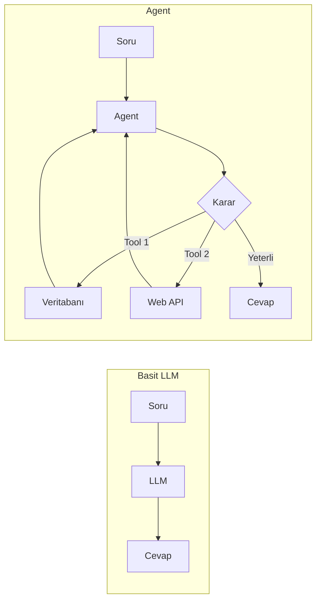
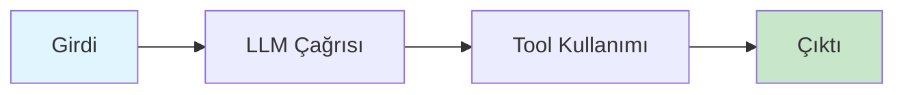
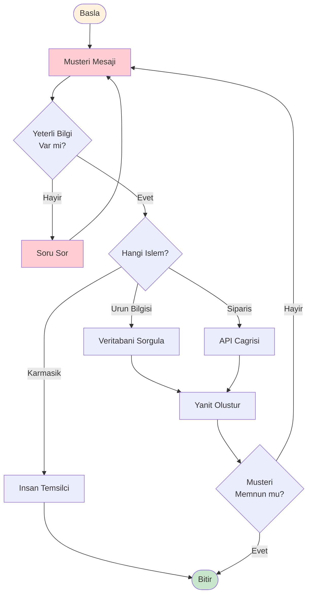
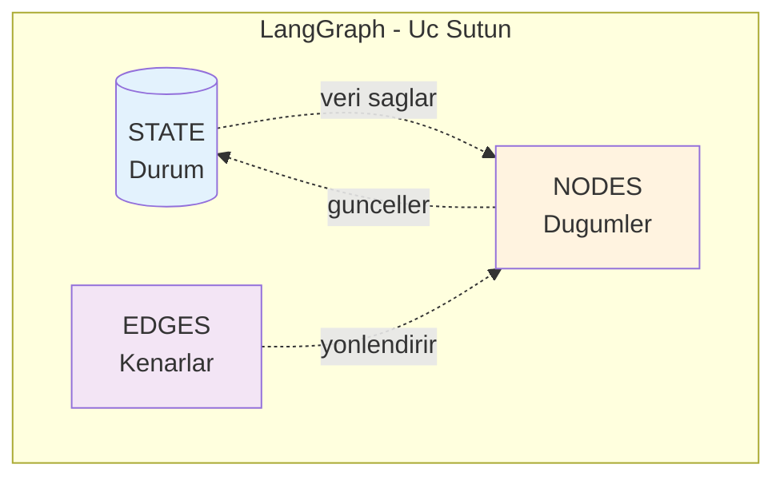
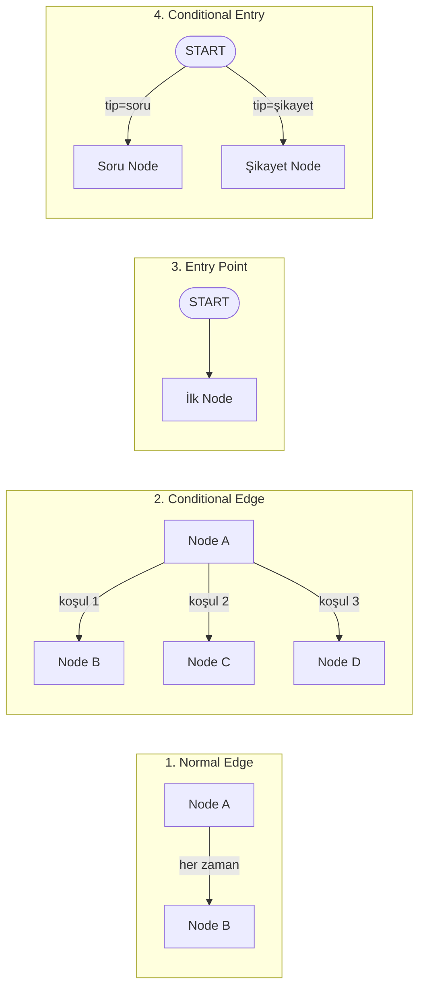
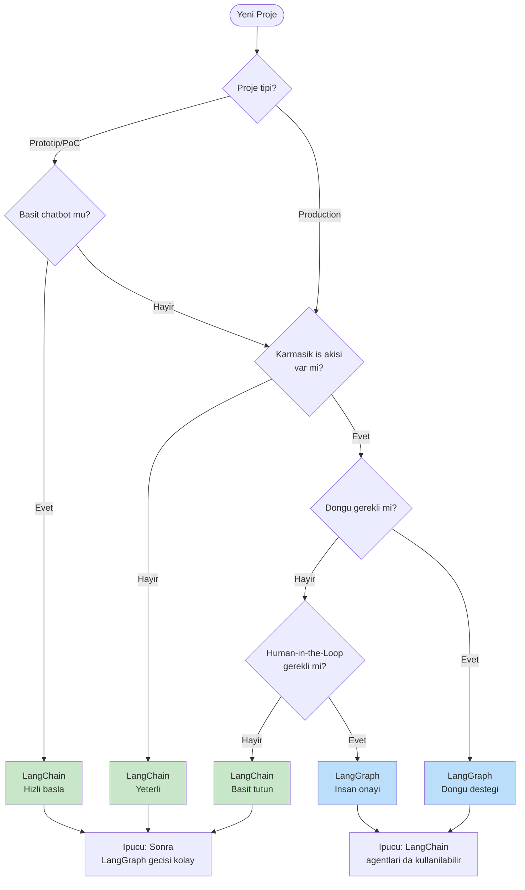
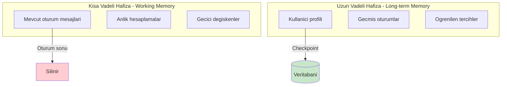
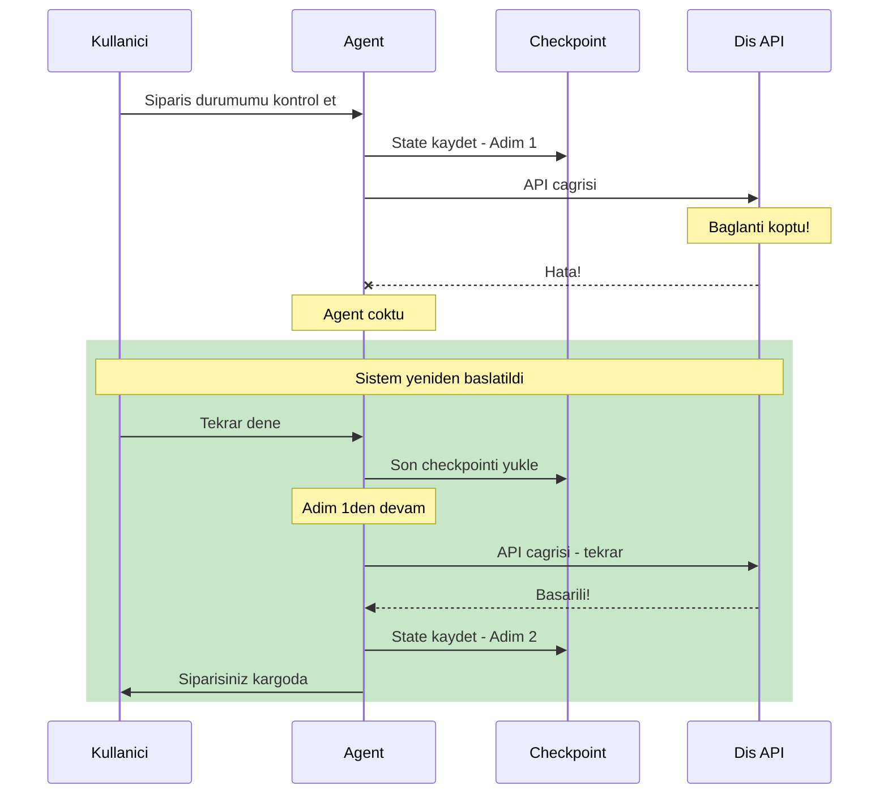
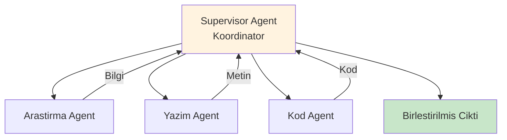
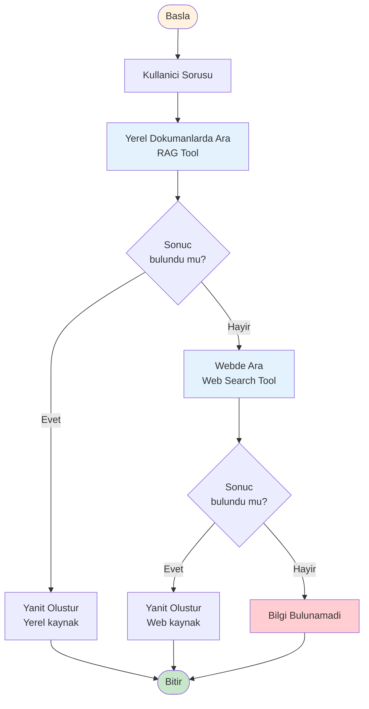

# Agent Tabanlı Sistemler ve LangGraph Mimarisi

> **Eğitim Süresi:** ~35-45 dakika
> **Seviye:** Orta
> **Ön Koşullar:** Python bilgisi, LLM kavramlarına aşinalık

---

## Öğrenme Hedefleri

Bu bölümü tamamladığınızda:

1. Agent kavramını ve basit LLM'den farkını açıklayabileceksiniz
2. LangChain ve LangGraph arasındaki temel farkları anlayacaksınız
3. Graf tabanlı düşünce modelini (State, Nodes, Edges) kavrayacaksınız
4. Durum yönetimi (State Management) ve koşullu iş akışlarını uygulayabileceksiniz
5. RAG + Web Arama senaryosu için bir agent tasarlayabileceksiniz

---

## 1. Agent Nedir? Neden Önemli?

Bir LLM varsayılan haliyle **pasiftir** — soru sorarsınız, cevap verir. Tool veya kontrol akışı olmadan, kendi başına karar alıp dış dünya ile etkileşemez.

**Agent** ise **aktif** bir sistemdir:

- Hangi aracı (tool) kullanacağına **karar verir**
- Araçları **çalıştırır** ve sonuçları değerlendirir
- Gerekirse **döngüye girer** (tekrar dener, ek bilgi toplar)

### Agent'ın Temeli: ReAct Döngüsü

ReAct (Reasoning + Acting), 2022'de yayınlanan ve agent kavramının **ilk pratik formülasyonlarından biri** olan paradigmadır. Günümüzde agent'lar ReAct dışında farklı yaklaşımlar da kullanır: **Plan-and-Execute**, **Tree-of-Thought**, **Graf tabanlı yürütme** (LangGraph'in yaklaşımı) ve **Multi-agent delegasyonu**. ReAct hala temel bir referans noktası olsa da, modern agent sistemleri genellikle **graf tabanlı**, **planlı** ve **durum yönetimli** yapılardır.

Temel ReAct döngüsü şöyle çalışır:

```
Soru: Türkiye'nin en yüksek dağının yüksekliği kaç metre?

Thought: Türkiye'nin en yüksek dağını bulmam gerekiyor.
Action: Search[Türkiye en yüksek dağ]
Observation: Ağrı Dağı

Thought: Şimdi yüksekliğini bulmam gerekiyor.
Action: Search[Ağrı Dağı yükseklik]
Observation: 5.137 metre

Thought: Cevabı buldum.
Action: Finish[5.137 metre]
```

**Thought → Action → Observation** döngüsü, agent'ların temel çalışma prensibidir.

> ⚠️ **Not:** Modern LLM API'lerinde (OpenAI, Anthropic, Google) "Thought" adımı modelin içsel muhakemesidir ve kullanıcıya açık değildir. Yukarıdaki örnek **kavramsal** bir gösterimdir. Agent framework'leri (LangChain, LangGraph) bu döngüyü **örtük (implicit)** olarak yönetir.

### Basit LLM vs Agent



| Özellik                 | Basit LLM            | Agent                    |
| ------------------------ | -------------------- | ------------------------ |
| Dış dünya erişimi    | ❌ Yok               | ✅ Tool'lar ile          |
| Döngü/tekrar           | ❌ Tek seferlik      | ✅ İhtiyaç kadar       |
| Karar verme              | ❌ Pasif             | ✅ Aktif                 |
| Durum (State) sahipliği | ❌ Yok / dışarıda | ✅ Native                |
| Kontrol akışı         | ❌ Lineer            | ✅ Koşullu + döngülü |

---

## 2. Motivasyon: Neden LangGraph?

### Gerçek Dünya Senaryosu: Akıllı Müşteri Destek Botu

Bir **e-ticaret müşteri destek botu** geliştirdiğinizi düşünün. Bu bot:

- Müşteri sorusunu anlamalı
- Gerekirse veritabanından ürün bilgisi çekmeli
- Sipariş durumunu kontrol etmeli
- Yeterli bilgi yoksa tekrar soru sormalı
- Karmaşık durumlarda insan temsilciye yönlendirmeli

**Soru:** Bu senaryo basit bir zincir (chain) ile çözülebilir mi?

### LangChain'in Yapısı: DAG (Yönlü Asiklik Graf)

LangChain'in klasik **chain** yapıları, bir **DAG (Directed Acyclic Graph)** mantığına yakın çalışır. DAG'ın Türkçe karşılığı "Yönlü Döngüsüz Çizge"dir.

> **Not:** LangChain'in `AgentExecutor`'ı döngüsel çalışabilir (tool → LLM → tool), ancak bu kontrol akışı framework tarafından yönetilir ve geliştiriciye açık değildir.



**DAG'ın Temel Kuralı:** Akış her zaman **ileri** gider. Bir node'a tekrar giremezsiniz, çünkü döngü (cycle) tanımı gereği yasaktır.

Bunu bir **tek yönlü cadde** gibi düşünün:

- Araba sadece ileri gidebilir
- U dönüşü yasak
- Geri vites yok

### Problem: Döngü İhtiyacı

Müşteri destek botumuz için gerçek akış şöyle olmalı:



Bu akışta **iki kritik döngü** var:

1. **Bilgi eksikliği döngüsü:** Yeterli bilgi yoksa → soru sor → tekrar analiz et
2. **Memnuniyet döngüsü:** Müşteri memnun değilse → başa dön

**LangChain agent'ları döngüsel çalışabilir; ancak bu döngüler geliştirici tarafından açıkça modellenemez ve kontrol edilemez. LangGraph, döngüyü ve durumu birinci sınıf (first-class) kavram haline getirerek bu sorunu çözer.**

### LangGraph'ın Çözümü

LangGraph, **graf tabanlı** bir mimari sunar. Graf yapısında:

- Döngüler mümkün
- Tanımladığınız edge'ler çerçevesinde, istediğiniz node'a geri dönebilirsiniz
- Koşullu dallanmalar tam kontrol altında
- Tüm geçişler **explicit (açık)** ve **deterministik**

| Özellik                       | LangChain (DAG)             | LangGraph (Graf)             |
| ------------------------------ | --------------------------- | ---------------------------- |
| **Yapı**                | Tek yönlü, döngüsüz    | Çok yönlü, döngülü     |
| **Analoji**              | Tek yönlü cadde           | Şehir haritası             |
| **Durum Yönetimi**      | Sınırlı                  | Tam kontrol                  |
| **Karmaşık Akışlar** | Zor/İmkansız              | Doğal                       |
| **Hata Kurtarma**        | Baştan başla              | Kaldığı yerden devam      |
| **Execution Model**      | Implicit (framework-driven) | Explicit (developer-defined) |
| **Observability**        | Sınırlı                  | Full (state, node, edge)     |

---

## 3. Temel Kavramlar: Graf Tabanlı Düşünce

LangGraph'ın mimarisi **üç temel yapı taşına** dayanır. Bunları anlamadan LangGraph kullanmak, haritasız şehirde dolaşmak gibidir.



---

### 3.1 State (Durum): Uygulamanın Hafızası

#### Ne İşe Yarar?

**State**, uygulamanızın herhangi bir andaki **tam durumunu** (snapshot) tutan veri yapısıdır. Tüm node'lar bu ortak state üzerinden iletişim kurar.

#### Analoji: Video Oyunu Save Dosyası

State'i bir video oyunundaki **save dosyası** gibi düşünün:

| Oyun Save Dosyası   | LangGraph State      |
| -------------------- | -------------------- |
| Karakterin konumu    | Mevcut adım         |
| Envanter durumu      | Toplanan bilgiler    |
| Tamamlanan görevler | İşlenmiş mesajlar |
| Can/Mana puanı      | Sayaçlar, skorlar   |
| Oyun ayarları       | Konfigürasyon       |

Oyunu kapattığınızda save dosyası sayesinde **kaldığınız yerden** devam edersiniz. LangGraph'ta State **aynı işlevi** görür.

#### Neden Önemli?

State olmadan:

- Her node birbirinden bağımsız çalışır
- Önceki adımların sonuçlarını bilemezsiniz
- Döngülerde bilgi kaybı yaşarsınız

State ile:

- Tüm node'lar aynı bilgiye erişir
- Geçmiş kararlar hatırlanır
- Döngülerde ilerleme kaydedilir

#### Kod Örneği: State Tanımlama

Python'da State tanımlamak için `TypedDict` veya `Pydantic` kullanılır:

```python
from typing import TypedDict, Annotated, List
from operator import add
from langgraph.graph import MessagesState

# Yöntem 1: TypedDict ile özel state
class MusteriDestekState(TypedDict):
    """
    Müşteri destek botunun durumunu tutan state.

    Her alan (field) belirli bir bilgiyi saklar.
    Node'lar bu alanları okuyup güncelleyebilir.

    ÖNEMLİ: Liste ve sayaç alanları için reducer tanımlanmalıdır,
    aksi halde varsayılan davranış (overwrite) geçmiş verileri siler!
    """

    # Konuşma geçmişi - tüm mesajlar burada
    # add reducer: Yeni mesajlar mevcut listeye EKLENİR (overwrite değil)
    mesajlar: Annotated[List[str], add]

    # Müşteri kimliği - veritabanı sorguları için
    # Reducer yok: Her güncellemede üzerine yazılır (tekil değer için OK)
    musteri_id: str

    # Müşteri memnuniyeti - döngü kontrolü için
    memnuniyet: bool

    # İşlem sayacı - sonsuz döngü koruması
    # add reducer: Sayılar TOPLANIR (0 + 1 + 1 = 2)
    islem_sayisi: Annotated[int, add]

    # Bulunan bilgiler - tool sonuçları
    bulunan_bilgiler: dict


# Yöntem 2: Hazır MessagesState kullanımı
# (Çoğu chatbot için yeterli)
class BasitChatState(MessagesState):
    """
    MessagesState otomatik olarak şunu içerir:
    - messages: List[BaseMessage] (reducer tanımlı, append davranışı)

    ÖNEMLİ: MessagesState kullanırken mesajlar HumanMessage, AIMessage
    gibi BaseMessage türlerinde olmalıdır, string değil!

    Biz sadece ekstra alanlar ekliyoruz.
    """
    kullanici_id: str
```

#### Reducer Fonksiyonları: State Nasıl Güncellenir?

##### Reducer Nedir?

**Reducer**, fonksiyonel programlamadan gelen bir kavramdır. İki değeri (eski state değeri ve yeni değer) alıp tek bir sonuç üreten fonksiyondur. Adı "indirgemek/azaltmak" anlamına gelir çünkü birden fazla değeri tek bir değere "indirger".

JavaScript'teki `Array.reduce()` veya Python'daki `functools.reduce()` ile aynı mantıktır:

```python
# Python reduce örneği: [1, 2, 3, 4] → 10 (toplam)
from functools import reduce
reduce(lambda acc, x: acc + x, [1, 2, 3, 4], 0)  # 10
```

##### LangGraph'ta Reducer

LangGraph'ta reducer, bir node state'i güncellediğinde devreye girer. "Yeni değer eskisinin üzerine mi yazılsın, yoksa eklensin mi?" sorusunu yanıtlar.

```python
from operator import add
from typing import Annotated

class SayacliState(TypedDict):
    # Varsayılan reducer: Üzerine yazar
    # Eski değer: "Ali" → Yeni değer: "Veli" → Sonuç: "Veli"
    kullanici_adi: str

    # add reducer: Toplar
    # Eski değer: 5 → Yeni değer: 3 → Sonuç: 8
    toplam_islem: Annotated[int, add]

    # Liste için özel reducer tanımlanabilir
    # Varsayılan olarak üzerine yazar, ama genelde append isteriz
    mesaj_gecmisi: List[str]  # ⚠️ Bu haliyle overwrite eder!

    # Doğru kullanım: Liste biriktirmek için add reducer gerekir
    mesaj_gecmisi_dogru: Annotated[List[str], add]
```

> ⚠️ **Kritik Uyarı:** Varsayılan reducer her zaman **overwrite** eder. Liste veya sayaç biriktirmek istiyorsanız **mutlaka** `Annotated[..., add]` kullanın. Bu hata runtime'da sessizce oluşur ve debug etmesi zordur!

| Reducer Tipi              | Davranış            | Kullanım Alanı           |
| ------------------------- | --------------------- | -------------------------- |
| **Varsayılan**     | Üzerine yazar        | Tekil değerler (isim, id) |
| **add**             | Sayıları toplar     | Sayaçlar, skorlar         |
| **append**          | Listeye ekler         | Mesaj geçmişi, loglar    |
| **Özel fonksiyon** | İstediğiniz mantık | Karmaşık birleştirmeler |

---

### 3.2 Nodes (Düğümler): İş Yapan Birimler

#### Ne İşe Yarar?

**Node**, grafınızdaki **iş yapan birimdir**. Her node bir Python fonksiyonudur ve tek bir görevi yerine getirir.

#### Analoji: Fabrika İstasyonları

Bir otomobil fabrikasını düşünün:

| Fabrika İstasyonu | LangGraph Node            |
| ------------------ | ------------------------- |
| Kaynak istasyonu   | `llm_cagir` node'u      |
| Boya istasyonu     | `tool_kullan` node'u    |
| Kalite kontrol     | `dogrula` node'u        |
| Paketleme          | `sonuc_formatla` node'u |

Her istasyon:

- Belirli bir iş yapar
- Önceki istasyonun çıktısını alır
- Sonraki istasyona geçirir

#### Node'un Anatomisi

Node'lar **en az** state parametresi alır. Gelişmiş kullanımlarda `config` parametresi de alınabilir, ancak bu her execution modunda garanti değildir.

```python
def ornek_node(
    state: MusteriDestekState     # Zorunlu: Mevcut durum
) -> dict:
    """
    Her node bu yapıyı takip eder:

    1. State'ten gerekli bilgileri OKU
    2. İş mantığını ÇALIŞTIR
    3. State güncellemesini DÖNDÜR

    Döndürülen dict, state'in ilgili alanlarını günceller.
    """

    # 1. OKUMA: State'ten bilgi al
    mevcut_mesajlar = state["mesajlar"]
    musteri_id = state["musteri_id"]

    # 2. İŞLEM: İş mantığı
    yeni_mesaj = f"Merhaba {musteri_id}, size nasıl yardımcı olabilirim?"

    # 3. GÜNCELLEME: State değişikliklerini döndür
    return {
        "mesajlar": mevcut_mesajlar + [yeni_mesaj],
        "islem_sayisi": state["islem_sayisi"] + 1
    }
```

#### Örnek Node'lar

**1. LLM Çağrısı Yapan Node:**

```python
from langchain_openai import ChatOpenAI
from langchain_core.messages import HumanMessage, AIMessage

# LLM'i bir kez tanımla, node'larda kullan
# Not: Güncel model adları için OpenAI dokümantasyonunu kontrol edin
llm = ChatOpenAI(model="gpt-4o")

def llm_ile_analiz(state: MusteriDestekState) -> dict:
    """
    Müşteri mesajını LLM ile analiz eder.

    Bu node:
    - Mesaj geçmişini alır
    - LLM'e gönderir
    - Yanıtı state'e ekler
    """

    # Mesajları al
    mesajlar = state["mesajlar"]

    # Boş mesaj kontrolü (güvenli erişim)
    if not mesajlar:
        return {"mesajlar": ["Henüz mesaj yok."], "islem_sayisi": 1}

    # LLM'i çağır - Message nesneleri kullanarak
    yanit = llm.invoke([
        HumanMessage(content=f"Müşteri mesajı: {mesajlar[-1]}\nBu mesajı analiz et ve uygun yanıt ver.")
    ])

    # Yanıtı ekle
    # Not: Reducer tanımlıysa sadece yeni değeri döndürmek yeterli
    return {
        "mesajlar": [yanit.content],  # add reducer ile mevcut listeye eklenir
        "islem_sayisi": 1              # add reducer ile mevcut sayıya eklenir
    }
```

**2. Veritabanı Sorgulayan Node (Tool Örneği):**

```python
def veritabani_sorgula(state: MusteriDestekState) -> dict:
    """
    Müşteri siparişlerini veritabanından çeker.

    Bu bir 'tool' örneğidir - dış dünya ile etkileşim.
    """

    musteri_id = state["musteri_id"]

    # Veritabanı sorgusu (gerçek uygulamada ORM kullanılır)
    siparisler = db.query(
        "SELECT * FROM siparisler WHERE musteri_id = ?",
        [musteri_id]
    )

    # Sonuçları state'e kaydet
    return {
        "bulunan_bilgiler": {
            "siparisler": siparisler,
            "siparis_sayisi": len(siparisler)
        }
    }
```

> ⚠️ **Production Notu:** Yukarıdaki örnek eğitim amaçlıdır. Gerçek uygulamalarda:
>
> - **Async veritabanı bağlantıları** kullanın (asyncpg, aiomysql)
> - **Connection pooling** uygulayın
> - LangGraph'ın async desteği için `async def` node'lar yazın
> - Blocking I/O, async graph'larda performans sorunlarına yol açar

**3. Karar Veren Node:**

```python
def memnuniyet_kontrol(state: MusteriDestekState) -> dict:
    """
    Müşteri memnuniyetini değerlendirir.

    Son mesajı analiz edip memnuniyet flag'ini günceller.
    """

    # Güvenli erişim: Mesaj listesi boşsa varsayılan değer döndür
    if not state["mesajlar"]:
        return {"memnuniyet": False}

    son_mesaj = state["mesajlar"][-1].lower()

    # Basit duygu analizi (gerçekte LLM kullanılabilir)
    pozitif_kelimeler = ["teşekkür", "harika", "süper", "memnun", "tamam"]
    negatif_kelimeler = ["hayır", "olmadı", "kötü", "sorun", "şikayet"]

    pozitif_skor = sum(1 for k in pozitif_kelimeler if k in son_mesaj)
    negatif_skor = sum(1 for k in negatif_kelimeler if k in son_mesaj)

    return {
        "memnuniyet": pozitif_skor > negatif_skor
    }
```

---

### 3.3 Edges (Kenarlar): Akış Kontrolü

#### Ne İşe Yarar?

**Edge**, node'lar arasındaki **geçişleri** tanımlar. "Bu node'dan sonra hangisi çalışacak?" sorusunun cevabıdır.

#### Analoji: Şehir Yolları

Şehirdeki yollar gibi düşünün:

| Yol Tipi              | Edge Tipi         | Açıklama                  |
| --------------------- | ----------------- | --------------------------- |
| Tek yönlü cadde     | Normal Edge       | A'dan B'ye her zaman git    |
| Kavşak               | Conditional Edge  | Duruma göre yön seç      |
| Şehir girişi        | Entry Point       | Başlangıç noktası       |
| Otoyol çıkışları | Conditional Entry | Duruma göre farklı başla |

#### 4 Tür Edge



#### Kod Örnekleri

**1. Normal Edge - Her Zaman Aynı Yol:**

```python
from langgraph.graph import StateGraph, START, END

# Graf oluştur
graph = StateGraph(MusteriDestekState)

# Node'ları ekle
graph.add_node("selamla", selamlama_node)
graph.add_node("analiz_et", analiz_node)
graph.add_node("yanitla", yanit_node)

# Normal edge: Sabit sıralama
graph.add_edge(START, "selamla")      # Başla → Selamla
graph.add_edge("selamla", "analiz_et") # Selamla → Analiz
graph.add_edge("analiz_et", "yanitla") # Analiz → Yanıtla
graph.add_edge("yanitla", END)         # Yanıtla → Bitir
```

**2. Conditional Edge - Duruma Göre Yön:**

```python
def yonlendirici(state: MusteriDestekState) -> str:
    """
    Conditional edge için karar fonksiyonu.

    State'i inceleyip sonraki node'un ADINI döndürür.

    ÖNEMLİ: Döndürülen string, add_conditional_edges'teki
    mapping dictionary'sinde MUTLAKA bulunmalıdır.
    Aksi halde runtime error alırsınız!
    """

    # Sonsuz döngü koruması
    if state["islem_sayisi"] > 5:
        return "insan_devret"

    # Memnuniyet kontrolü
    if state["memnuniyet"]:
        return "bitir"

    # Bilgi eksikliği kontrolü
    if not state["bulunan_bilgiler"]:
        return "bilgi_topla"

    # Varsayılan: tekrar dene
    return "tekrar_analiz"


# Conditional edge tanımla
graph.add_conditional_edges(
    "analiz_et",           # Kaynak node
    yonlendirici,          # Karar fonksiyonu
    {
        # Karar fonksiyonunun döndürdüğü değer → Hedef node
        "bitir": END,
        "insan_devret": "insan_temsilci",
        "bilgi_topla": "veritabani_sorgula",
        "tekrar_analiz": "llm_ile_analiz"
    }
)
```

**3. Entry Point - Başlangıç Noktası:**

```python
# Basit başlangıç: Her zaman aynı node ile başla
graph.add_edge(START, "ilk_node")

# VEYA set_entry_point kullanarak
graph.set_entry_point("ilk_node")
```

**4. Conditional Entry - Duruma Göre Başlangıç:**

```python
def baslangic_yonlendirici(state: MusteriDestekState) -> str:
    """Gelen mesajın tipine göre farklı node ile başla."""

    ilk_mesaj = state["mesajlar"][0].lower()

    if "şikayet" in ilk_mesaj or "sorun" in ilk_mesaj:
        return "sikayet_node"
    elif "sipariş" in ilk_mesaj:
        return "siparis_node"
    else:
        return "genel_node"


graph.add_conditional_edges(
    START,
    baslangic_yonlendirici,
    {
        "sikayet_node": "sikayet_isle",
        "siparis_node": "siparis_sorgula",
        "genel_node": "genel_yanit"
    }
)
```

---

## 4. LangChain vs LangGraph: Detaylı Karşılaştırma

### Ne Zaman Hangisi?

Bu iki framework rakip değil, **tamamlayıcıdır**. Doğru aracı seçmek için projenizin ihtiyaçlarını anlayın.

### Kapsamlı Karşılaştırma Tablosu

| Kriter                       | LangChain 1.0                    | LangGraph 1.0                    |
| ---------------------------- | -------------------------------- | -------------------------------- |
| **Soyutlama Seviyesi** | Yüksek (high-level)             | Düşük (low-level)             |
| **Öğrenme Eğrisi**  | Kolay, hızlı başlangıç      | Daha dik, detay gerektirir       |
| **Kod Miktarı**       | Az (hazır şablonlar)           | Fazla (her şey manuel)          |
| **Esneklik**           | Sınırlı özelleştirme        | Tam kontrol                      |
| **State Yönetimi**    | Otomatik, basit                  | Manuel, güçlü                 |
| **Döngü Desteği**   | Var ama implicit (AgentExecutor) | Explicit, tam kontrol            |
| **Human-in-the-Loop**  | Custom implementasyon gerekir    | Framework-native, standart API   |
| **Hata Toleransı**    | Manual / custom persistence      | Native checkpoint + resume       |
| **Çoklu Agent**       | Sınırlı destek                | Native destek                    |
| **Streaming**          | Token-level                      | Execution event-level            |
| **Debug/Test**         | Standart                         | Görselleştirme desteği        |
| **Kullanım Alanı**   | Prototip, basit botlar           | Production, karmaşık sistemler |

### v1.0 Güncellemeleri

Her iki framework de v1.0 seviyesinde stabil API'ler sunmaktadır. En önemli değişiklik: **Artık birlikte çalışıyorlar.**

```
┌───────────────────────────────────────────────────┐
│              Kullanıcı Uygulaması                 │
├───────────────────────────────────────────────────┤
│        LangChain 1.0 (Yüksek Seviye API)          │
│   • create_agent()  • Middleware  • Chains        │
│   • Hazır şablonlar • Hızlı prototipleme          │
├───────────────────────────────────────────────────┤
│        LangGraph 1.0 (Düşük Seviye Runtime)       │
│   • StateGraph  • Nodes  • Edges  • Memory        │
│   • Checkpointing  • Human-in-the-Loop            │
└───────────────────────────────────────────────────┘
```

**Kritik Bilgi:** Yeni nesil LangChain agent altyapısı, LangGraph'in runtime prensiplerinden faydalanmaktadır. Bu şu anlama gelir:

- LangChain ile başlayıp, gerektiğinde LangGraph'a geçebilirsiniz
- İkisi arasında veri/state paylaşımı mümkün
- "Ya biri ya öteki" değil, "ikisi birlikte" yaklaşımı

> **Not:** Her LangChain agent otomatik olarak LangGraph runtime kullanmaz. Özellikle yeni API'ler (`create_react_agent` vb.) bu entegrasyondan faydalanır.

### Karar Ağacı: Hangisini Kullanmalıyım?



---

## 5. State Management Derinlemesine

### MessagesState: En Yaygın Kullanım

Çoğu LLM uygulaması mesaj tabanlıdır. LangGraph bunun için hazır bir yapı sunar:

```python
from langgraph.graph import MessagesState
from langchain_core.messages import HumanMessage, AIMessage

class ChatBotState(MessagesState):
    """
    MessagesState otomatik olarak şunu içerir:
    - messages: List[BaseMessage] (append reducer ile)

    BaseMessage türleri:
    - HumanMessage: Kullanıcıdan gelen
    - AIMessage: LLM'den gelen
    - SystemMessage: Sistem talimatları
    - ToolMessage: Tool çıktıları

    ⚠️ ÖNEMLİ: messages alanına string DEĞİL, BaseMessage türevleri eklenmelidir!
    """

    # Ekstra alanlar ekleyebiliriz
    kullanici_id: str
    oturum_baslangic: str
    tercihler: dict


# ❌ YANLIŞ - String ekleme
# return {"messages": ["merhaba"]}

# ✅ DOĞRU - BaseMessage kullanma
# return {"messages": [HumanMessage(content="merhaba")]}
```

### Memory Türleri

LangGraph iki tür hafıza destekler:



| Hafıza Türü         | Kapsam           | Saklama     | Kullanım         | Örnek                      |
| ---------------------- | ---------------- | ----------- | ----------------- | --------------------------- |
| **Kısa Vadeli** | Tek oturum       | RAM         | Aktif konuşma    | Son 10 mesaj                |
| **Uzun Vadeli**  | Oturumlar arası | Veritabanı | Kişiselleştirme | Kullanıcı adı, tercihler |

> **Not:** LangGraph, uzun vadeli hafıza için **altyapı** (checkpoint mekanizması) sunar. Ancak hafızanın anlamı, yapısı ve yönetimi **uygulama tarafından** belirlenir. "Kullanıcı profili" veya "öğrenilen tercihler" otomatik olarak oluşmaz; bunları state'e eklemek ve yönetmek geliştiricinin sorumluluğundadır.

### Checkpoint Mekanizması: Kaldığı Yerden Devam

Checkpoint, state'in **belirli anlarda otomatik kaydedilmesidir**. Bu özellik production sistemlerde hayat kurtarır.

```python
from langgraph.checkpoint.memory import MemorySaver
from langgraph.graph import StateGraph
from uuid import uuid4

# 1. Checkpoint sağlayıcısı oluştur
checkpointer = MemorySaver()  # RAM'de (SADECE test/demo için!)
# Production için: SqliteSaver, PostgresSaver kullanın

# 2. Graf'ı oluştur ve checkpoint ile derle
graph_builder = StateGraph(ChatBotState)
# ... node'lar ve edge'ler eklenir ...
app = graph_builder.compile(checkpointer=checkpointer)

# 3. Oturum ID'si ile çalıştır
# ⚠️ GÜVENLİK: thread_id tahmin edilemez ve kullanıcı bazlı olmalıdır!
user_id = "musteri-123"
session_id = str(uuid4())
config = {"configurable": {"thread_id": f"{user_id}:{session_id}"}}

# İlk mesaj
sonuc1 = app.invoke(
    {"messages": [HumanMessage(content="Siparişim nerede?")]},
    config
)

# İkinci mesaj - önceki context korunur (aynı oturum içinde)
sonuc2 = app.invoke(
    {"messages": [HumanMessage(content="Kargo takip numarası neydi?")]},
    config  # Aynı thread_id
)
```

> ⚠️ **Production Uyarıları:**
>
> - `MemorySaver` **yalnızca RAM'de** çalışır. Uygulama yeniden başlatıldığında tüm state kaybolur!
> - Production'da **mutlaka** `SqliteSaver`, `PostgresSaver` veya benzeri persistent saver kullanın.
> - `thread_id` yanlış yönetilirse kullanıcılar birbirinin state'ini görebilir. **Her zaman kullanıcı bazlı ve tahmin edilemez** ID'ler kullanın.

**Checkpoint'in Faydaları:**

| Senaryo               | Checkpoint Olmadan        | Checkpoint ile                    |
| --------------------- | ------------------------- | --------------------------------- |
| Sunucu çöktü       | ❌ Tüm ilerleme kaybolur | ✅ Son adımdan devam             |
| Uzun işlem           | ❌ Zaman aşımı riski   | ✅ Parça parça işle            |
| Kullanıcı ara verdi | ❌ Baştan başla         | ✅ Kaldığı yerden              |
| Debug gerekli         | ❌ Tüm akışı tekrarla | ✅ State geçmişi incelenebilir* |

> *Checkpoint, debug için **temel altyapı** sağlar. Step-level replay ve state inspection için ek araçlar (LangSmith, custom tooling) kullanılabilir.

---

## 6. İleri Düzey Özellikler

### 6.1 Durable Execution (Dayanıklı Çalışma)

**Durable Execution**, bir programın çalışması sırasında hata oluşsa bile (sunucu çökmesi, ağ kesintisi, zaman aşımı vb.) kaldığı yerden devam edebilmesini sağlayan bir mimari yaklaşımdır. "Durable" kelimesi "dayanıklı/kalıcı" anlamına gelir.

Bu özellik, uzun süren agent'lar için kritiktir. Dış servislere bağımlı işlemlerde hata kaçınılmazdır.



> ⚠️ **Kritik Uyarı - Idempotency:** Durable execution, checkpoint'ten fazlasını gerektirir. Dış API çağrıları veya yan etki (side-effect) içeren node'lar **idempotent** olmalıdır. Restart sonrası aynı node tekrar çalışabilir; bu durumda API çağrısı **tekrarlanır**. E-posta gönderme, ödeme işlemi, ticket açma gibi senaryolarda bu **duplicate işlemlere** yol açar.
>
> **Çözüm:** Side-effect içeren node'larda işlem ID'si ile "zaten yapıldı mı?" kontrolü ekleyin veya external servisin idempotency key desteğini kullanın.

### 6.2 Human-in-the-Loop (İnsan Müdahalesi)

**Human-in-the-Loop (HITL)**, otomasyon süreçlerinde kritik noktalarda insan onayı veya müdahalesi gerektiren bir tasarım desenidir. Agent tamamen otonom çalışmak yerine, belirli kararlarda durur ve insan onayı bekler.

Kritik kararları otomatik almak yerine insana bırakma:

```python
# Hangi node'lardan önce durulacağını belirt
graph = graph_builder.compile(
    checkpointer=checkpointer,
    interrupt_before=["odeme_yap", "siparis_iptal"]  # Bu node'lardan önce dur
)

# Çalıştır - "odeme_yap" node'una gelince duracak
sonuc = graph.invoke(state, config)

# ... İnsan onay verdi ...

# Devam et
sonuc = graph.invoke(None, config)  # None = kaldığı yerden devam
```

**Kullanım Senaryoları:**

- 💰 Büyük tutarlı finansal işlemler (>1000 TL)
- 🗑️ Geri alınamaz aksiyonlar (silme, gönderme)
- 🔐 Hassas veri erişimi (kişisel bilgiler)
- ❓ Belirsiz durumlar (düşük güven skoru)

> **Mimari Not:** Human-in-the-Loop'ta graph **bloklanmaz**. State "waiting" olarak persist edilir ve graph sonlanır. İnsan onayı geldiğinde, aynı `thread_id` ile yeni bir `invoke` çağrısı yapılır. Bu **asenkron** bir modeldir:
>
> - UI, graph'in bitmesini beklemez
> - Graph, external event (webhook, queue message, polling) ile tetiklenir
> - Backend mimarinizde bu async akışı tasarlamanız gerekir (WebSocket, polling, veya message queue)

### 6.3 Streaming Outputs

**Streaming**, verilerin tamamının hazır olmasını beklemek yerine, parça parça (chunk) işlenmesi ve iletilmesidir.

LangGraph **iki farklı streaming türü** destekler:

| Streaming Türü          | Ne Stream Edilir                                         | Kullanım Alanı                     |
| ------------------------- | -------------------------------------------------------- | ------------------------------------ |
| **Token Streaming** | LLM'in ürettiği her token                              | Kullanıcıya canlı yazı gösterme |
| **Event Streaming** | Graph event'leri (node başladı/bitti, state değişti) | Debug, progress bar, logging         |

> **Not:** Bu iki mekanizma farklıdır. Token streaming için LLM'in streaming desteği, event streaming için graph'in event handler'ları gerekir.

Gerçek zamanlı çıktı akışı - kullanıcı beklemez:

```python
# Senkron streaming
for event in graph.stream({"messages": [mesaj]}):
    if "messages" in event:
        print(event["messages"][-1].content, end="", flush=True)

# Asenkron streaming
async for event in graph.astream({"messages": [mesaj]}):
    if "messages" in event:
        await websocket.send(event["messages"][-1].content)
```

### 6.4 Multi-Agent Sistemler

**Multi-Agent sistemi**, birden fazla bağımsız agent'ın birlikte çalışarak karmaşık görevleri çözdüğü bir mimaridir. Her agent belirli bir alanda uzmanlaşır ve bir koordinatör (supervisor) agent bu uzman agent'ları yönetir.

Birden fazla uzman agent'ın koordinasyonu:



> ⚠️ **Multi-Agent Tasarım Uyarıları:**
>
> - **State izolasyonu:** Agent'lar aynı state'i paylaşır. Bir agent'ın yaptığı değişiklik diğerlerini etkiler. İzolasyon gerekiyorsa **explicit olarak** tasarlanmalıdır (örn: agent-specific state alanları).
> - **Tool erişimi:** Tüm agent'lar varsayılan olarak tüm tool'lara erişebilir. Tool sandboxing **otomatik değildir**; hangi agent'ın hangi tool'u kullanabileceğini siz belirlemelisiniz.
> - **Parallel execution:** Birden fazla agent paralel çalışıyorsa, aynı state alanına yazan agent'lar için **reducer tanımı zorunludur**. Aksi halde race condition ve veri kaybı yaşanır.

---

## 7. Uygulama Senaryosu: RAG + Web Arama Ajanı

Bu bölüm, eğitimin uygulama kısmına (Notebook 02 ve 03) doğrudan hazırlık sağlar.

### Senaryo Tanımı

**Görev:** Kullanıcının sorusunu yanıtlayan bir agent oluşturun.

**Kural:**

1. **Önce** yerel dokümanlarda ara (RAG)
2. Bulunamazsa **sonra** web'de ara
3. Her iki kaynaktan da bulunamazsa "Bilgi bulunamadı" de

### Akış Diyagramı



### Tool Tanımlamaları

```python
from langchain_core.tools import tool
from langchain_community.vectorstores import FAISS
from langchain_community.utilities import GoogleSearchAPIWrapper

# Tool 1: Yerel Dokümanlarda Arama (RAG)
@tool
def yerel_dokuman_ara(soru: str) -> str:
    """
    Yerel veritabanındaki dokümanlarda arama yapar.

    Bu tool, şirket içi dokümanlarda, FAQ'larda veya
    önceden indekslenmiş içeriklerde arama yapar.

    Args:
        soru: Kullanıcının sorusu

    Returns:
        Bulunan ilgili doküman parçaları veya boş string
    """
    # Vector store'dan ilgili dokümanları getir
    vectorstore = FAISS.load_local("dokumanlar_index")
    sonuclar = vectorstore.similarity_search(soru, k=3)

    if sonuclar:
        return "\n\n".join([doc.page_content for doc in sonuclar])
    return ""


# Tool 2: Web'de Arama
@tool
def web_ara(soru: str) -> str:
    """
    İnternet'te arama yapar.

    Bu tool, yerel dokümanlarda bilgi bulunamadığında
    güncel web içeriklerinde arama yapar.

    Args:
        soru: Aranacak sorgu

    Returns:
        Web arama sonuçları veya boş string
    """
    search = GoogleSearchAPIWrapper()
    sonuclar = search.results(soru, num_results=3)

    if sonuclar:
        return "\n\n".join([
            f"Başlık: {r['title']}\nÖzet: {r['snippet']}"
            for r in sonuclar
        ])
    return ""
```

### State Tanımı

```python
from typing import TypedDict, List, Optional

class RAGWebState(TypedDict):
    """RAG + Web Arama Agent'ı için state."""

    # Kullanıcı sorusu
    soru: str

    # Arama sonuçları
    yerel_sonuc: str      # RAG sonucu
    web_sonuc: str        # Web arama sonucu

    # Kullanılan kaynak
    kaynak: str           # "yerel", "web", veya "yok"

    # Final yanıt
    yanit: str

    # Mesaj geçmişi (opsiyonel)
    messages: List
```

### Node Tanımlamaları

```python
def yerel_arama_node(state: RAGWebState) -> dict:
    """Yerel dokümanlarda arama yapar."""
    soru = state["soru"]
    sonuc = yerel_dokuman_ara.invoke(soru)

    return {"yerel_sonuc": sonuc}


def web_arama_node(state: RAGWebState) -> dict:
    """Web'de arama yapar."""
    soru = state["soru"]
    sonuc = web_ara.invoke(soru)

    return {"web_sonuc": sonuc}


def yanit_olustur_node(state: RAGWebState) -> dict:
    """Bulunan bilgilerle yanıt oluşturur."""

    if state["yerel_sonuc"]:
        kaynak = "yerel"
        bilgi = state["yerel_sonuc"]
    elif state["web_sonuc"]:
        kaynak = "web"
        bilgi = state["web_sonuc"]
    else:
        return {
            "kaynak": "yok",
            "yanit": "Üzgünüm, sorunuzla ilgili bilgi bulunamadı."
        }

    # LLM ile yanıt oluştur
    prompt = f"""
    Kullanıcı sorusu: {state['soru']}

    Bulunan bilgi ({kaynak} kaynağından):
    {bilgi}

    Bu bilgiyi kullanarak kullanıcıya yardımcı bir yanıt oluştur.
    """

    yanit = llm.invoke(prompt)

    return {
        "kaynak": kaynak,
        "yanit": yanit.content
    }
```

### Yönlendirici Fonksiyon

```python
def arama_yonlendirici(state: RAGWebState) -> str:
    """
    Yerel arama sonucuna göre yönlendirir.

    - Sonuç varsa → yanıt oluştur
    - Sonuç yoksa → web'de ara
    """
    if state["yerel_sonuc"]:
        return "yanit_olustur"
    else:
        return "web_ara"


def web_sonuc_kontrol(state: RAGWebState) -> str:
    """
    Web arama sonucuna göre yönlendirir.

    Her durumda yanıt oluştur (boş da olsa).
    """
    return "yanit_olustur"
```

### Graf Oluşturma

```python
from langgraph.graph import StateGraph, START, END

# Graf oluştur
graph = StateGraph(RAGWebState)

# Node'ları ekle
graph.add_node("yerel_ara", yerel_arama_node)
graph.add_node("web_ara", web_arama_node)
graph.add_node("yanit_olustur", yanit_olustur_node)

# Edge'leri tanımla
graph.add_edge(START, "yerel_ara")

graph.add_conditional_edges(
    "yerel_ara",
    arama_yonlendirici,
    {
        "yanit_olustur": "yanit_olustur",
        "web_ara": "web_ara"
    }
)

graph.add_edge("web_ara", "yanit_olustur")
graph.add_edge("yanit_olustur", END)

# Derle
app = graph.compile()
```

### Çalıştırma

```python
# Test 1: Yerel dokümanda bulunabilecek soru
sonuc1 = app.invoke({
    "soru": "Şirketimizin iade politikası nedir?",
    "yerel_sonuc": "",
    "web_sonuc": "",
    "kaynak": "",
    "yanit": "",
    "messages": []
})
print(f"Kaynak: {sonuc1['kaynak']}")  # "yerel"
print(f"Yanıt: {sonuc1['yanit']}")

# Test 2: Sadece web'de bulunabilecek soru
sonuc2 = app.invoke({
    "soru": "Bugün dolar kuru kaç TL?",
    "yerel_sonuc": "",
    "web_sonuc": "",
    "kaynak": "",
    "yanit": "",
    "messages": []
})
print(f"Kaynak: {sonuc2['kaynak']}")  # "web"
print(f"Yanıt: {sonuc2['yanit']}")
```

---

## 8. Pratik: Graf Oluşturma - 7 Adım

LangGraph ile herhangi bir workflow oluşturmak için bu adımları takip edin:

```python
# ═══════════════════════════════════════════════════════════
# ADIM 1: Gerekli Import'lar
# ═══════════════════════════════════════════════════════════
from langgraph.graph import StateGraph, START, END
from typing import TypedDict

# ═══════════════════════════════════════════════════════════
# ADIM 2: State Şemasını Tanımla
# ═══════════════════════════════════════════════════════════
class BenimState(TypedDict):
    mesajlar: list
    adim: int

# ═══════════════════════════════════════════════════════════
# ADIM 3: Node Fonksiyonlarını Yaz
# ═══════════════════════════════════════════════════════════
def adim_bir(state: BenimState) -> dict:
    print("Adım 1 çalışıyor...")
    return {"mesajlar": ["Adım 1 tamamlandı"], "adim": 1}

def adim_iki(state: BenimState) -> dict:
    print("Adım 2 çalışıyor...")
    return {"mesajlar": state["mesajlar"] + ["Adım 2 tamamlandı"], "adim": 2}

def yonlendir(state: BenimState) -> str:
    if state["adim"] < 2:
        return "adim_iki"
    return END

# ═══════════════════════════════════════════════════════════
# ADIM 4: StateGraph Oluştur
# ═══════════════════════════════════════════════════════════
graph = StateGraph(BenimState)

# ═══════════════════════════════════════════════════════════
# ADIM 5: Node'ları Ekle
# ═══════════════════════════════════════════════════════════
graph.add_node("adim_bir", adim_bir)
graph.add_node("adim_iki", adim_iki)

# ═══════════════════════════════════════════════════════════
# ADIM 6: Edge'leri Tanımla
# ═══════════════════════════════════════════════════════════
graph.add_edge(START, "adim_bir")
graph.add_conditional_edges("adim_bir", yonlendir)
graph.add_edge("adim_iki", END)

# ═══════════════════════════════════════════════════════════
# ADIM 7: Derle ve Çalıştır
# ═══════════════════════════════════════════════════════════
app = graph.compile()

# Görselleştir (opsiyonel)
print(app.get_graph().draw_mermaid())

# Çalıştır
sonuc = app.invoke({"mesajlar": [], "adim": 0})
print(sonuc)
# Çıktı: {'mesajlar': ['Adım 1 tamamlandı', 'Adım 2 tamamlandı'], 'adim': 2}
```

---

## 9. Özet ve Anahtar Kavramlar

### Hızlı Referans Tablosu

| Kavram                     | Tanım                       | Hatırlatıcı Analoji        |
| -------------------------- | ---------------------------- | ----------------------------- |
| **State**            | Uygulamanın anlık durumu   | 🎮 Oyun save dosyası         |
| **Node**             | İş yapan fonksiyon         | 🏭 Fabrika istasyonu          |
| **Edge**             | Node'lar arası geçiş      | 🛤️ Fabrika konveyör bandı |
| **Reducer**          | State güncelleme mantığı | 📝 Üzerine yaz mı, ekle mi? |
| **Checkpoint**       | State'in kaydedilmesi        | 💾 Otomatik yedekleme         |
| **Conditional Edge** | Koşullu yönlendirme        | 🚦 Trafik ışığı          |

### LangChain vs LangGraph - Tek Cümle

```
LangChain = Hızlı başlangıç + Hazır şablonlar + Prototip
LangGraph = Tam kontrol + Döngüler + Production-ready
```

### Öğrendiklerinizi Test Edin

Kendinize şu soruları sorun:

- [ ] State nedir ve neden önemlidir?
- [ ] Node ve Edge arasındaki fark nedir?
- [ ] Conditional Edge ne zaman kullanılır?
- [ ] LangChain yerine LangGraph ne zaman tercih edilmeli?
- [ ] RAG + Web Arama senaryosunu kafamda canlandırabiliyor muyum?

---

## 10. Sonraki Adımlar: Uygulamaya Geçiş

Bu teori bölümünü tamamladınız. Şimdi öğrendiklerinizi **pratiğe dökme** zamanı!

### Notebook Sıralaması

| Sıra | Notebook                                                                                      | İçerik                             | Süre  |
| ----- | --------------------------------------------------------------------------------------------- | ------------------------------------ | ------ |
| 1️⃣ | [02_build_rag_search_agent_with_langchain.ipynb](02_build_rag_search_agent_with_langchain.ipynb) | LangChain ile RAG agent              | ~30 dk |
| 2️⃣ | [03_build_rag_search_agent_with_langgraph.ipynb](03_build_rag_search_agent_with_langgraph.ipynb) | Aynı problemi LangGraph ile çözme | ~45 dk |

### Ne Beklemeli?

**Notebook 02 (LangChain):**

- Hızlı prototipleme
- Hazır agent şablonları
- Basit RAG implementasyonu

**Notebook 03 (LangGraph):**

- Aynı problem, farklı yaklaşım
- Döngüsel akış (önce yerel, sonra web)
- State yönetimi pratiği
- LangChain'den farkları görme

---

## 11. Production Checklist: Sık Yapılan Hatalar

Bu bölüm, LangGraph ile production'a çıkarken **mutlaka kontrol edilmesi gereken** kritik noktaları özetler.

### ❌ En Sık Yapılan 10 Hata

| # | Hata | Sonuç | Çözüm |
|---|------|-------|-------|
| 1 | MessagesState'e string eklemek | Sessiz bozulma, debug kabusu | `HumanMessage`, `AIMessage` kullan |
| 2 | Reducer tanımlamadan liste kullanmak | Veri kaybı (overwrite) | `Annotated[List[str], add]` kullan |
| 3 | `MemorySaver` ile production'a çıkmak | Restart sonrası tüm state kaybolur | `SqliteSaver`, `PostgresSaver` kullan |
| 4 | `thread_id`'yi sabit/tahmin edilebilir yapmak | Kullanıcılar birbirinin state'ini görür | `f"{user_id}:{uuid4()}"` kullan |
| 5 | Side-effect'li node'ları idempotent yazmamak | Restart sonrası duplicate işlemler | İşlem ID kontrolü veya idempotency key |
| 6 | HITL'i blocking olarak tasarlamak | Timeout, ölçeklenme sorunları | Async state machine olarak tasarla |
| 7 | Token streaming ile event streaming'i karıştırmak | Yanlış UX beklentisi | İkisini ayrı mekanizma olarak ele al |
| 8 | Paralel node'larda reducer tanımlamamak | Race condition, undefined davranış | Paylaşılan state alanlarına reducer ekle |
| 9 | Multi-agent'ta state izolasyonu düşünmemek | Agent'lar birbirini sabote eder | Agent-specific state alanları tasarla |
| 10 | "Checkpoint = Durable Execution" sanmak | Kısmi dayanıklılık | Checkpoint + idempotent node = gerçek durable |

### ⚠️ Sık Yanlış Anlaşılan 5 Kavram

| Kavram | Yanlış Anlama | Gerçek |
|--------|---------------|--------|
| **LangGraph** | Bir framework | Bir **runtime** - kontrol tamamen sizde |
| **Agent Zekası** | LLM'den gelir | Prompt'tan gelir, davranış graph'tan |
| **Memory** | Otomatik özellik | Tasarım kararı - LangGraph sadece taşıyıcı |
| **Debugging** | Checkpoint ile gelir | Checkpoint = veri, debug = ek tooling gerekir |
| **Production Başarısı** | Güçlü LLM ile gelir | Mimari tasarımdan gelir |

### ✅ Production-Ready Checklist

Production'a çıkmadan önce şunları kontrol edin:

- [ ] `MemorySaver` yerine persistent checkpointer kullanılıyor
- [ ] `thread_id` kullanıcı bazlı ve tahmin edilemez
- [ ] Liste/sayaç alanlarında reducer tanımlı
- [ ] MessagesState'e sadece BaseMessage türleri ekleniyor
- [ ] Side-effect içeren node'lar idempotent
- [ ] HITL akışları async olarak tasarlanmış
- [ ] Paralel node'lar için reducer'lar tanımlı
- [ ] Multi-agent'ta state izolasyonu explicit

---

## Kaynaklar

### Resmi Dokümantasyon

- [LangChain & LangGraph v1.0 Duyurusu](https://www.blog.langchain.com/langchain-langgraph-1dot0/)
- [LangGraph Resmi Dokümantasyonu](https://docs.langchain.com/oss/python/langgraph/graph-api)

### Öğrenme Kaynakları

- [LangGraph Architecture & Design](https://medium.com/@shuv.sdr/langgraph-architecture-and-design-280c365aaf2c)
- [Real Python - LangGraph Tutorial](https://realpython.com/langgraph-python/)
- [LangGraph Visualization Guide](https://kitemetric.com/blogs/visualizing-langgraph-workflows-with-get-graph)

### Akademik Makaleler (İleri Okuma)

- **ReAct:** Yao et al. (2022) - "ReAct: Synergizing Reasoning and Acting in Language Models" - Agent kavramının teorik temeli
- **Chain-of-Thought:** Wei et al. (2022) - "Chain-of-Thought Prompting Elicits Reasoning in Large Language Models"
- **Zero-Shot CoT:** Kojima et al. (2022) - "Large Language Models are Zero-Shot Reasoners"

### Video Kaynaklar

- LangChain YouTube Kanalı - LangGraph 101 Serisi

---

*Bu materyal, AI practitioners için hazırlanmış uygulamalı eğitim serisinin bir parçasıdır.*

*Son güncelleme: 2025*
