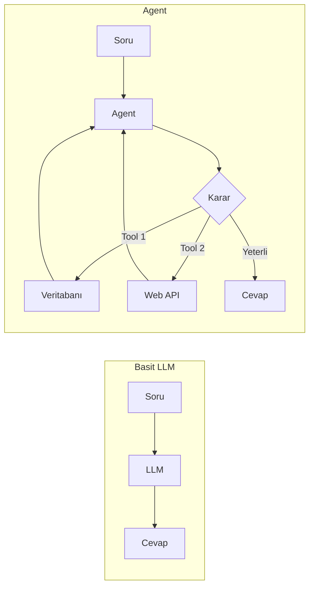
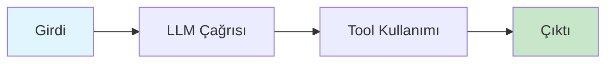
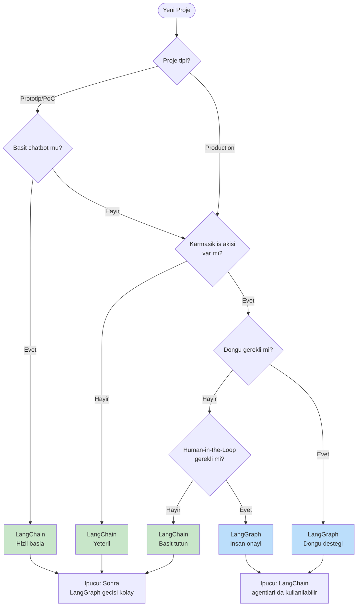
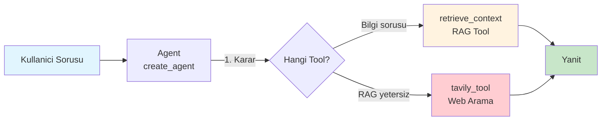

# LangChain ile RAG + Web Arama Ajanı Oluşturma

> **Eğitim Süresi:** ~20-25 dakika
> **Seviye:** Orta
> **Ön Koşullar:** Python bilgisi, LLM kavramlarına aşinalık
> **Notebook:** [02_build_rag_search_agent_with_langchain.ipynb](02_build_rag_search_agent_with_langchain.ipynb)

---

## Öğrenme Hedefleri

Bu bölümü tamamladığınızda:

1. Agent kavramını ve basit LLM'den farkını açıklayabileceksiniz
2. LangChain'in yüksek seviye agent API'sini (`create_agent`) kullanabileceksiniz
3. RAG (Retrieval Augmented Generation) ile bilgi tabanı oluşturabileceksiniz
4. Tool tanımlamaları yapabileceksiniz (RAG + Web Arama)
5. System prompt ile agent davranışını yönlendirebileceksiniz

---

## 1. Agent Nedir? Neden Önemli?

Bir LLM varsayılan haliyle **pasiftir** — soru sorarsınız, cevap verir. Tool veya kontrol akışı olmadan, kendi başına karar alıp dış dünya ile etkileşemez.

**Agent** ise **aktif** bir sistemdir:

- Hangi aracı (tool) kullanacağına **karar verir**
- Araçları **çalıştırır** ve sonuçları değerlendirir
- Gerekirse **döngüye girer** (tekrar dener, ek bilgi toplar)

### Agent'ın Temeli: ReAct Döngüsü

ReAct (Reasoning + Acting), agent kavramının **ilk pratik formülasyonlarından biri** olan paradigmadır. Temel döngüsü:

```
Soru: Türkiye'nin en yüksek dağının yüksekliği kaç metre?

Thought: Türkiye'nin en yüksek dağını bulmam gerekiyor.
Action: Search[Türkiye en yüksek dağ]
Observation: Ağrı Dağı

Thought: Şimdi yüksekliğini bulmam gerekiyor.
Action: Search[Ağrı Dağı yükseklik]
Observation: 5.137 metre

Thought: Cevabı buldum.
Action: Finish[5.137 metre]
```

**Thought → Action → Observation** döngüsü, agent'ların temel çalışma prensibidir.

> **Not:** Modern LLM API'lerinde "Thought" adımı modelin içsel muhakemesidir ve kullanıcıya açık değildir. Agent framework'leri (LangChain, LangGraph) bu döngüyü **örtük (implicit)** olarak yönetir.

### Basit LLM vs Agent



| Özellik                 | Basit LLM            | Agent                    |
| ------------------------ | -------------------- | ------------------------ |
| Dış dünya erişimi    | Yok               | Tool'lar ile          |
| Döngü/tekrar           | Tek seferlik      | İhtiyaç kadar       |
| Karar verme              | Pasif             | Aktif                 |
| Kontrol akışı         | Lineer            | Koşullu + döngülü |

---

## 2. LangChain'in Yaklaşımı

### Yüksek Seviye API: Hızlı Başlangıç

LangChain, agent oluşturmayı **mümkün olduğunca basit** hale getiren yüksek seviye bir API sunar. `create_agent()` fonksiyonu tüm karmaşıklığı sizin yerinize yönetir.

**Avantajları:**
- Az kod ile hızlı prototipleme
- Hazır şablonlar ve yapılar
- Tool entegrasyonu tek satırda
- System prompt ile davranış kontrolü

### DAG Yapısı

LangChain'in klasik **chain** yapıları, bir **DAG (Directed Acyclic Graph / Yönlü Döngüsüz Çizge)** mantığına yakın çalışır:



**DAG'ın Temel Kuralı:** Akış her zaman **ileri** gider. Bunu bir **tek yönlü cadde** gibi düşünün — geri dönüş yok.

> **Not:** LangChain'in `AgentExecutor`'ı ve yeni `create_agent` API'si döngüsel çalışabilir (tool → LLM → tool), ancak bu kontrol akışı framework tarafından yönetilir. Daha fazla kontrol istiyorsanız → LangGraph.

### v1.0: LangChain + LangGraph Birlikte

Yeni nesil LangChain agent altyapısı, LangGraph'in runtime prensiplerinden faydalanmaktadır:

```
┌───────────────────────────────────────────────────┐
│              Kullanıcı Uygulaması                 │
├───────────────────────────────────────────────────┤
│        LangChain 1.0 (Yüksek Seviye API)          │
│   • create_agent()  • Middleware  • Chains        │
│   • Hazır şablonlar • Hızlı prototipleme          │
├───────────────────────────────────────────────────┤
│        LangGraph 1.0 (Düşük Seviye Runtime)       │
│   • StateGraph  • Nodes  • Edges  • Memory        │
│   • Checkpointing  • Human-in-the-Loop            │
└───────────────────────────────────────────────────┘
```

Bu, LangChain ile başlayıp gerektiğinde LangGraph'a geçebileceğiniz anlamına gelir.

---

## 3. LangChain vs LangGraph: Ne Zaman Hangisi?

Bu iki framework rakip değil, **tamamlayıcıdır**. Doğru aracı seçmek için projenizin ihtiyaçlarını anlayın.

| Kriter                       | LangChain 1.0                    | LangGraph 1.0                    |
| ---------------------------- | -------------------------------- | -------------------------------- |
| **Soyutlama Seviyesi** | Yüksek (high-level)             | Düşük (low-level)             |
| **Öğrenme Eğrisi**  | Kolay, hızlı başlangıç      | Daha dik, detay gerektirir       |
| **Kod Miktarı**       | Az (hazır şablonlar)           | Fazla (her şey manuel)          |
| **Esneklik**           | Sınırlı özelleştirme        | Tam kontrol                      |
| **Döngü Desteği**   | Var ama implicit (AgentExecutor) | Explicit, tam kontrol            |
| **Human-in-the-Loop**  | Custom implementasyon gerekir    | Framework-native                 |
| **Kullanım Alanı**   | Prototip, basit botlar           | Production, karmaşık sistemler |

### Karar Ağacı



**Tek Cümle:**

```
LangChain = Hızlı başlangıç + Hazır şablonlar + Prototip
LangGraph = Tam kontrol + Döngüler + Production-ready
```

---

## 4. Uygulama: RAG + Web Arama Ajanı (LangChain)

### Senaryo

**Görev:** Lilian Weng'in "LLM Powered Autonomous Agents" blog yazısı üzerine RAG + Web Arama agent'ı oluşturun.

**Kural:**

1. Bilgi gerektiren sorular için önce **RAG tool'u** ile yerel dokümanlarda ara
2. RAG'dan gelen bilgi yetersizse → **Tavily** ile web'de ara
3. Basit sorular (matematik, selamlama) için direkt yanıt ver

**Bilgi Kaynağı:**
- Blog URL: `https://lilianweng.github.io/posts/2023-06-23-agent/`
- Konular: Self-Reflection, Memory, Tool Use, Planning vb.

### 4.1 Bilgi Tabanı Oluşturma (Knowledge Base)

İlk adım, blog içeriğini yükleyip vektör veritabanına dönüştürmek:

```python
import bs4
from langchain_chroma import Chroma
from langchain_community.document_loaders import WebBaseLoader
from langchain_text_splitters import RecursiveCharacterTextSplitter
from langchain_google_genai import GoogleGenerativeAIEmbeddings

# Embeddings modeli
embeddings = GoogleGenerativeAIEmbeddings(model="models/gemini-embedding-001")

# Blog içeriğini yükle
loader = WebBaseLoader(
    web_paths=("https://lilianweng.github.io/posts/2023-06-23-agent/",),
    bs_kwargs=dict(
        parse_only=bs4.SoupStrainer(
            class_=("post-content", "post-title", "post-header")
        )
    ),
)
docs = loader.load()

# Metni parçalara ayır
text_splitter = RecursiveCharacterTextSplitter(chunk_size=1000, chunk_overlap=200)
all_splits = text_splitter.split_documents(docs)

# Vector Store oluştur (Chroma kullanarak)
vector_store = Chroma.from_documents(
    documents=all_splits,
    embedding=embeddings,
    collection_name="agent_blog_context"
)
```

**Bu adımda ne oluyor?**
1. `WebBaseLoader` blog sayfasını indirir
2. `SoupStrainer` sadece ilgili HTML class'larını filtreler
3. `RecursiveCharacterTextSplitter` metni ~1000 karakterlik parçalara böler
4. `Chroma` bu parçaları embedding vektörlerine dönüştürüp depolar

### 4.2 Tool Tanımlamaları

Agent'ın kullanabileceği iki araç tanımlıyoruz:

```python
from langchain_core.tools import tool
from langchain_community.tools.tavily_search import TavilySearchResults

# Tool 1: Yerel Dokümanlarda Arama (RAG)
@tool(response_format="content_and_artifact")
def retrieve_context(query: str):
    """
    Searches the internal vector database to retrieve relevant documents
    and context matching the input query.
    """
    retrieved_docs = vector_store.similarity_search(query, k=2)
    serialized = "\n\n".join(
        (f"Source: {doc.metadata}\nContent: {doc.page_content}")
        for doc in retrieved_docs
    )
    return serialized, retrieved_docs

# Tool 2: Web'de Arama (Tavily)
tavily_tool = TavilySearchResults(
    max_results=3,
    description=(
        "Performs a live web search to find current information, facts, "
        "and data from the internet."
    )
)
```

**Tool Açıklamaları:**

| Tool | Amaç | Ne Zaman Kullanılır? |
|------|-------|----------------------|
| `retrieve_context` | Vektör veritabanından alakalı dokümanları bul | Blog hakkında sorular (Self-Reflection, Memory vb.) |
| `tavily_tool` | Web'de canlı arama yap | Bilgi tabanında bulunmayan güncel sorular |

> **`response_format="content_and_artifact"`** parametresi, tool'un hem metin içerik hem de ham doküman nesnelerini döndürmesini sağlar.

### 4.3 Agent Oluşturma

```python
from langchain.agents import create_agent
from langchain.chat_models import init_chat_model

# Tool listesi
tools = [retrieve_context, tavily_tool]

# Model tanımla (Google Gemini)
model = init_chat_model("google_genai:gemini-2.5-flash")

# System Prompt - Agent davranışını belirler
system_prompt = """
    You are a helpful assistant. You must answer the user's questions using the following strictly ordered process:
    1. **SEARCH INTERNAL**: First, use the 'retrieve_context' tool to check for local information regarding the query.
    2. **EVALUATE**: If the 'retrieve_context' output contains the answer, use it to respond and stop there.
    3. **SEARCH EXTERNAL**: ONLY if the internal context is missing or insufficient, use the 'tavily_search_results_json' tool to look up the answer on the web.
"""

# Agent oluştur
agent = create_agent(model, tools, system_prompt=system_prompt)
```

**Kritik Noktalar:**

1. **`create_agent()`**: Tüm agent mekanizmasını (tool seçimi, döngü, mesaj yönetimi) sizin yerinize kurar
2. **System Prompt**: Agent'ın davranış kurallarını belirler. Burada "önce RAG, sonra web" sıralamasını zorluyoruz
3. **Tool listesi**: Agent her iki tool'u da görebilir ve kendi karar verir

### 4.4 System Prompt Tasarımı

System prompt, agent'ın **beyni**dir. Doğru tasarım kritik:

```
┌─────────────────────────────────────────┐
│           System Prompt                 │
│                                         │
│  1. SEARCH INTERNAL  (retrieve_context) │
│         ↓                               │
│  2. EVALUATE         (yeterli mi?)      │
│         ↓                               │
│  3. SEARCH EXTERNAL  (tavily)           │
└─────────────────────────────────────────┘
```

**Neden bu sıralama?**
- RAG tool'u daha hızlı ve maliyetsiz
- Web araması rate limit ve maliyet içerir
- Yerel bilgi daha güvenilir (hallucination riski düşük)

> **Önemli:** LangChain agent'ı bu sıralamayı **genellikle** takip eder, ancak **garanti etmez**. LLM kendi kararını verebilir. Kesin kontrol istiyorsanız → LangGraph (Notebook 03).

### 4.5 Test Senaryoları

```python
# Test 1: Blog hakkında soru (RAG kullanmalı)
query = "What is 'Self-Reflection' in the context of LLM agents?"
for step in agent.stream(
    {"messages": [{"role": "user", "content": query}]},
    stream_mode="values",
):
    step["messages"][-1].pretty_print()
```

**Beklenen Akış:**
1. Agent `retrieve_context` tool'unu çağırır
2. RAG veritabanından Self-Reflection hakkında dokümanlar döner
3. Agent bu bilgiyle yanıt üretir

```python
# Test 2: Güncel olay sorusu (RAG başarısız → Tavily kullanmalı)
query = "What nation hosted the Euro 2024?"
for step in agent.stream(
    {"messages": [{"role": "user", "content": query}]},
    stream_mode="values",
):
    step["messages"][-1].pretty_print()
```

**Beklenen Akış:**
1. Agent önce `retrieve_context` ile arar (bulamaz)
2. RAG sonuçları yetersiz, `tavily_search_results_json` ile web'de arar
3. "Germany" yanıtını üretir

### Akış Özeti



---

## 5. Özet ve Sonraki Adımlar

### Bu Bölümde Öğrendikleriniz

| Kavram | Açıklama |
|--------|----------|
| **Agent** | LLM + Tool kullanım kararı + Döngü |
| **create_agent()** | LangChain'in yüksek seviye agent API'si |
| **RAG Tool** | Vektör veritabanından bilgi çekme |
| **Tavily Tool** | Web'de canlı arama yapma |
| **System Prompt** | Agent davranışını yönlendiren kurallar |

### LangChain Agent'ın Sınırlamaları

Bu notebook'ta fark edebileceğiniz noktalar:

1. **Kontrol akışı implicit:** Agent'ın hangi sırayla tool kullanacağını tam olarak kontrol edemezsiniz
2. **Grader mekanizması yok:** RAG sonuçlarının kalitesi değerlendirilmiyor — agent kendi karar veriyor
3. **Akış görünürlüğü sınırlı:** Hangi adımda olduğunuzu detaylı görmek zor

Bu sınırlamaları çözmek için → **Notebook 03: LangGraph ile aynı problemi tam kontrol ile çözme**

### Sonraki Adım

| Notebook | İçerik |
|----------|--------|
| [03_build_rag_search_agent_with_langgraph.ipynb](03_build_rag_search_agent_with_langgraph.ipynb) | Aynı RAG + Web Arama problemi, LangGraph ile tam kontrol, Grader mekanizması, conditional edges |

**LangGraph'ta neler farklı olacak:**
- **Grader kontrolü:** RAG sonuçları alakalı mı? (LLM ile değerlendirme)
- **Explicit akış:** Hangi node'dan hangisine gittiğinizi siz belirlersiniz
- **Conditional edges:** Duruma göre farklı yollar
- **Debug kolaylığı:** Her node'un giriş/çıkışını görebilirsiniz

---

## Kaynaklar

- [LangChain & LangGraph v1.0 Duyurusu](https://www.blog.langchain.com/langchain-langgraph-1dot0/)
- [LangChain Resmi Dokümantasyonu](https://docs.langchain.com/)
- **ReAct:** Yao et al. (2022) - "ReAct: Synergizing Reasoning and Acting in Language Models"

---

*Bu materyal, AI practitioners için hazırlanmış uygulamalı eğitim serisinin bir parçasıdır.*

*Son güncelleme: Şubat 2026*
