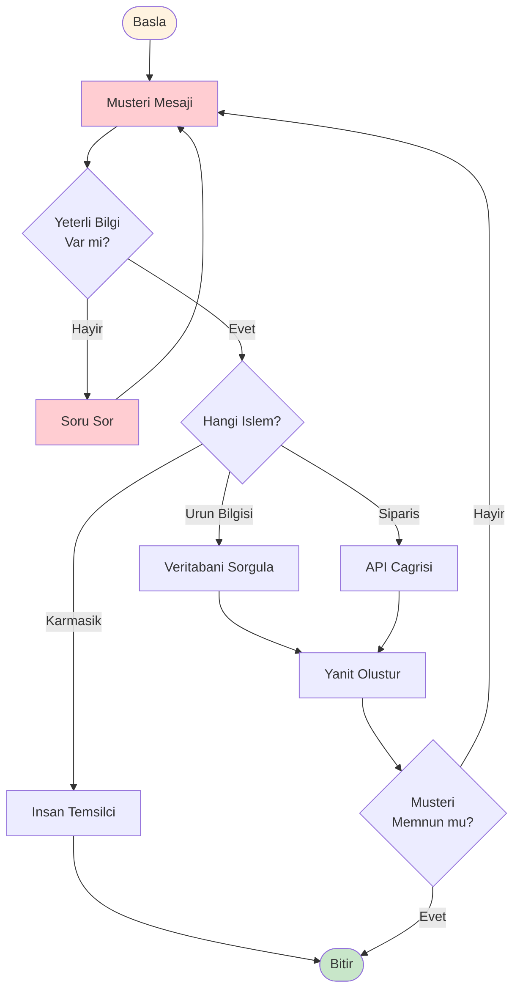
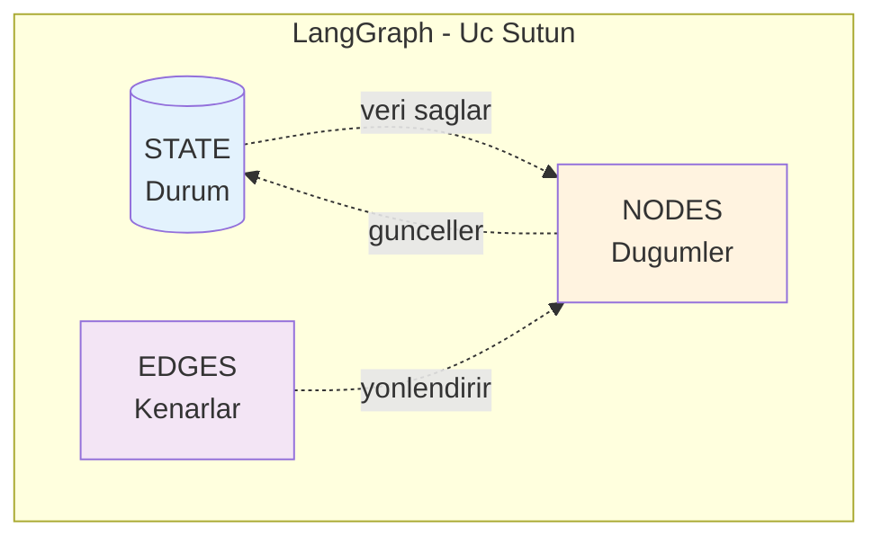
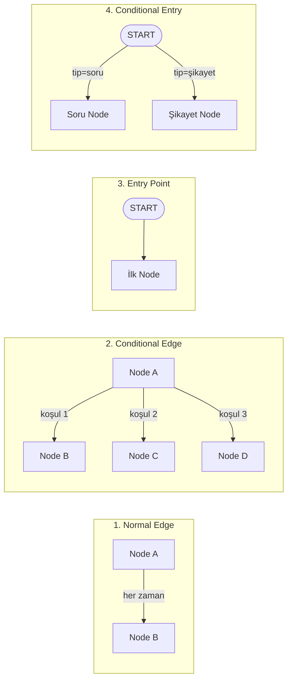
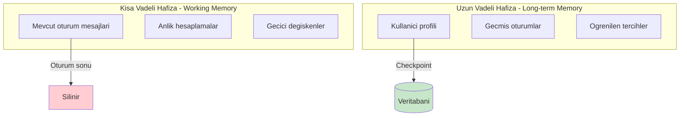
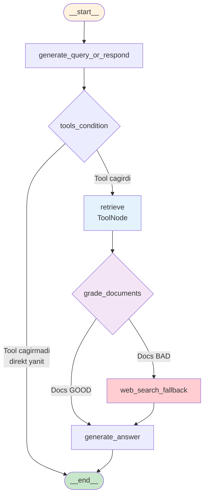
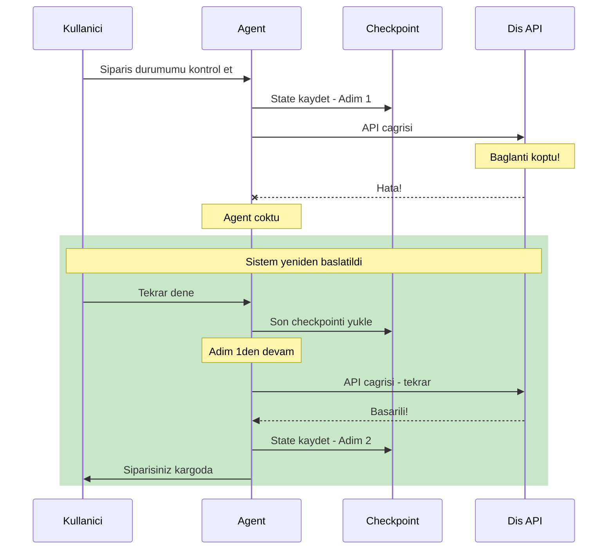
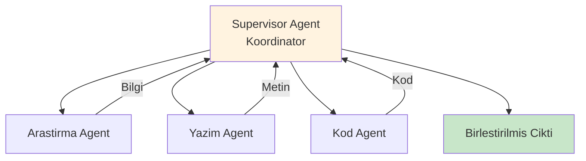

# LangGraph ile RAG + Web Arama Ajanı Oluşturma

> **Eğitim Süresi:** ~35-45 dakika
> **Seviye:** Orta-İleri
> **Ön Koşullar:** Python bilgisi, LLM kavramlarına aşinalık, Notebook 02'yi tamamlamış olmak
> **Notebook:** [03_build_rag_search_agent_with_langgraph.ipynb](03_build_rag_search_agent_with_langgraph.ipynb)

---

## Öğrenme Hedefleri

Bu bölümü tamamladığınızda:

1. LangChain ve LangGraph arasındaki temel farkları anlayacaksınız
2. Graf tabanlı düşünce modelini (State, Nodes, Edges) kavrayacaksınız
3. Durum yönetimi (State Management) ve koşullu iş akışlarını uygulayabileceksiniz
4. Grader mekanizması ile doküman kalitesi değerlendirmeyi öğreneceksiniz
5. RAG + Web Arama senaryosu için tam kontrollü bir agent tasarlayabileceksiniz

---

## 1. Neden LangGraph? Motivasyon

### Notebook 02'den Hatırlayalım

Notebook 02'de LangChain ile bir RAG + Web Arama agent'ı oluşturduk. Çalışıyordu, ancak bazı sınırlamaları vardı:

- Agent'ın hangi tool'u hangi sırayla kullanacağını **tam kontrol edemiyorduk**
- RAG sonuçlarının kalitesini **değerlendiremiyorduk** (Grader yoktu)
- Akışın hangi adımda olduğunu **detaylı göremiyorduk**

LangGraph bu sorunları çözer.

### Gerçek Dünya Senaryosu: Akıllı Müşteri Destek Botu

Bir **e-ticaret müşteri destek botu** geliştirdiğinizi düşünün. Bu bot:

- Müşteri sorusunu anlamalı
- Gerekirse veritabanından ürün bilgisi çekmeli
- Sipariş durumunu kontrol etmeli
- Yeterli bilgi yoksa tekrar soru sormalı
- Karmaşık durumlarda insan temsilciye yönlendirmeli

Bu senaryoda **iki kritik döngü** var:



1. **Bilgi eksikliği döngüsü:** Yeterli bilgi yoksa → soru sor → tekrar analiz et
2. **Memnuniyet döngüsü:** Müşteri memnun değilse → başa dön

**LangChain agent'ları döngüsel çalışabilir; ancak bu döngüler geliştirici tarafından açıkça modellenemez ve kontrol edilemez. LangGraph, döngüyü ve durumu birinci sınıf (first-class) kavram haline getirerek bu sorunu çözer.**

### LangGraph'ın Çözümü

LangGraph, **graf tabanlı** bir mimari sunar:

- Döngüler mümkün
- Koşullu dallanmalar tam kontrol altında
- Tüm geçişler **explicit (açık)** ve **deterministik**

| Özellik                       | LangChain (DAG)             | LangGraph (Graf)             |
| ------------------------------ | --------------------------- | ---------------------------- |
| **Yapı**                | Tek yönlü, döngüsüz    | Çok yönlü, döngülü     |
| **Analoji**              | Tek yönlü cadde           | Şehir haritası             |
| **Durum Yönetimi**      | Sınırlı                  | Tam kontrol                  |
| **Karmaşık Akışlar** | Zor/İmkansız              | Doğal                       |
| **Hata Kurtarma**        | Baştan başla              | Kaldığı yerden devam      |
| **Execution Model**      | Implicit (framework-driven) | Explicit (developer-defined) |

---

## 2. Temel Kavramlar: Graf Tabanlı Düşünce

LangGraph'ın mimarisi **üç temel yapı taşına** dayanır:



---

### 2.1 State (Durum): Uygulamanın Hafızası

**State**, uygulamanızın herhangi bir andaki **tam durumunu** (snapshot) tutan veri yapısıdır. Tüm node'lar bu ortak state üzerinden iletişim kurar.

#### Analoji: Video Oyunu Save Dosyası

| Oyun Save Dosyası   | LangGraph State      |
| -------------------- | -------------------- |
| Karakterin konumu    | Mevcut adım         |
| Envanter durumu      | Toplanan bilgiler    |
| Tamamlanan görevler | İşlenmiş mesajlar |
| Can/Mana puanı      | Sayaçlar, skorlar   |

#### Kod Örneği: State Tanımlama

Python'da State tanımlamak için `TypedDict` veya `Pydantic` kullanılır. Notebook'umuzda **MessagesState** kullanıyoruz:

```python
from typing import TypedDict, Annotated, List
from operator import add
from langgraph.graph import MessagesState, StateGraph, START, END
from langchain_core.messages import HumanMessage, AIMessage, SystemMessage

# Yöntem 1: TypedDict ile özel state
class MusteriDestekState(TypedDict):
    """Müşteri destek botunun durumunu tutan state."""

    # add reducer: Yeni mesajlar mevcut listeye EKLENİR (overwrite değil)
    mesajlar: Annotated[List[str], add]

    # Reducer yok: Her güncellemede üzerine yazılır
    musteri_id: str

    # add reducer: Sayılar TOPLANIR
    islem_sayisi: Annotated[int, add]

    bulunan_bilgiler: dict


# Yöntem 2: Hazır MessagesState kullanımı (ÖNERİLEN)
# Notebook'umuzda bu yaklaşımı kullanıyoruz
class BasitChatState(MessagesState):
    """
    MessagesState otomatik olarak şunu içerir:
    - messages: List[BaseMessage] (reducer tanımlı, append davranışı)

    MessagesState kullanırken mesajlar HumanMessage, AIMessage
    gibi BaseMessage türlerinde olmalıdır, string değil!
    """
    kullanici_id: str
```

#### Reducer Fonksiyonları: State Nasıl Güncellenir?

**Reducer**, eski state değeri ve yeni değeri alıp tek bir sonuç üreten fonksiyondur. "Yeni değer eskisinin üzerine mi yazılsın, yoksa eklensin mi?" sorusunu yanıtlar.

```python
from operator import add
from typing import Annotated

class SayacliState(TypedDict):
    # Varsayılan: Üzerine yazar
    kullanici_adi: str

    # add reducer: Toplar (5 + 3 = 8)
    toplam_islem: Annotated[int, add]

    # Liste biriktirmek için add reducer GEREKLİ
    mesaj_gecmisi: Annotated[List[str], add]
```

> **Kritik Uyarı:** Varsayılan reducer her zaman **overwrite** eder. Liste veya sayaç biriktirmek istiyorsanız **mutlaka** `Annotated[..., add]` kullanın. Bu hata runtime'da sessizce oluşur ve debug etmesi zordur!

| Reducer Tipi              | Davranış            | Kullanım Alanı           |
| ------------------------- | --------------------- | -------------------------- |
| **Varsayılan**     | Üzerine yazar        | Tekil değerler (isim, id) |
| **add**             | Sayıları toplar     | Sayaçlar, skorlar         |
| **append**          | Listeye ekler         | Mesaj geçmişi, loglar    |
| **Özel fonksiyon** | İstediğiniz mantık | Karmaşık birleştirmeler |

---

### 2.2 Nodes (Düğümler): İş Yapan Birimler

**Node**, grafınızdaki **iş yapan birimdir**. Her node bir Python fonksiyonudur ve tek bir görevi yerine getirir.

#### Analoji: Fabrika İstasyonları

| Fabrika İstasyonu | LangGraph Node            |
| ------------------ | ------------------------- |
| Kaynak istasyonu   | `llm_cagir` node'u      |
| Boya istasyonu     | `tool_kullan` node'u    |
| Kalite kontrol     | `dogrula` node'u        |
| Paketleme          | `sonuc_formatla` node'u |

#### Node'un Anatomisi

Her node: State'ten okur → İşlem yapar → State günceller:

```python
def ornek_node(state: MessagesState) -> dict:
    """
    1. State'ten gerekli bilgileri OKU
    2. İş mantığını ÇALIŞTIR
    3. State güncellemesini DÖNDÜR
    """
    # 1. OKUMA
    mesajlar = state["messages"]

    # 2. İŞLEM
    yanit = llm.invoke(mesajlar)

    # 3. GÜNCELLEME
    return {"messages": [yanit]}
```

---

### 2.3 Edges (Kenarlar): Akış Kontrolü

**Edge**, node'lar arasındaki **geçişleri** tanımlar. "Bu node'dan sonra hangisi çalışacak?" sorusunun cevabıdır.

#### 4 Tür Edge



#### Kod Örnekleri

**Normal Edge:** Her zaman aynı yol:

```python
graph.add_edge(START, "selamla")      # Başla → Selamla
graph.add_edge("selamla", "analiz_et") # Selamla → Analiz
graph.add_edge("analiz_et", END)       # Analiz → Bitir
```

**Conditional Edge:** Duruma göre yön:

```python
def yonlendirici(state) -> str:
    """State'i inceleyip sonraki node'un ADINI döndürür."""
    if state["memnuniyet"]:
        return "bitir"
    return "tekrar_analiz"

graph.add_conditional_edges(
    "analiz_et",           # Kaynak node
    yonlendirici,          # Karar fonksiyonu
    {
        "bitir": END,
        "tekrar_analiz": "llm_ile_analiz"
    }
)
```

---

## 3. State Management Derinlemesine

### MessagesState: En Yaygın Kullanım

Çoğu LLM uygulaması mesaj tabanlıdır. LangGraph bunun için hazır bir yapı sunar:

```python
from langgraph.graph import MessagesState
from langchain_core.messages import HumanMessage, AIMessage

class ChatBotState(MessagesState):
    """
    MessagesState otomatik olarak şunu içerir:
    - messages: List[BaseMessage] (append reducer ile)

    BaseMessage türleri:
    - HumanMessage: Kullanıcıdan gelen
    - AIMessage: LLM'den gelen
    - SystemMessage: Sistem talimatları
    - ToolMessage: Tool çıktıları
    """
    kullanici_id: str

# ❌ YANLIŞ - String ekleme
# return {"messages": ["merhaba"]}

# ✅ DOĞRU - BaseMessage kullanma
# return {"messages": [HumanMessage(content="merhaba")]}
```

### Memory Türleri

LangGraph iki tür hafıza destekler:



| Hafıza Türü         | Kapsam           | Saklama     | Kullanım         |
| ---------------------- | ---------------- | ----------- | ----------------- |
| **Kısa Vadeli** | Tek oturum       | RAM         | Aktif konuşma    |
| **Uzun Vadeli**  | Oturumlar arası | Veritabanı | Kişiselleştirme |

### Checkpoint Mekanizması

Checkpoint, state'in **belirli anlarda otomatik kaydedilmesidir**:

```python
from langgraph.checkpoint.memory import MemorySaver

checkpointer = MemorySaver()  # RAM'de (SADECE test/demo için!)
app = graph_builder.compile(checkpointer=checkpointer)

# Oturum ID'si ile çalıştır
config = {"configurable": {"thread_id": f"{user_id}:{session_id}"}}

# İlk mesaj
sonuc1 = app.invoke(
    {"messages": [HumanMessage(content="Siparişim nerede?")]},
    config
)

# İkinci mesaj - önceki context korunur
sonuc2 = app.invoke(
    {"messages": [HumanMessage(content="Kargo takip numarası neydi?")]},
    config  # Aynı thread_id
)
```

> **Production Uyarısı:** `MemorySaver` **yalnızca RAM'de** çalışır. Production'da **mutlaka** `SqliteSaver`, `PostgresSaver` kullanın.

---

## 4. Uygulama: RAG + Web Arama Ajanı (LangGraph)

Şimdi Notebook 02'deki aynı problemi LangGraph ile çözeceğiz — bu sefer **tam kontrol** ve **Grader mekanizması** ile.

### Akış Diyagramı



**5 Adımlı Akış:**
1. **generate_query_or_respond**: Agent karar verir (tool kullan mı, direkt yanıtla mı?)
2. **retrieve**: RAG tool'u çalışır, vektör veritabanından doküman çeker
3. **grade_documents**: Dokümanlar alakalı mı kontrol eder (Grader)
4. **web_search_fallback**: Dokümanlar yetersizse Tavily ile web araması
5. **generate_answer**: Final yanıt üretimi

### 4.1 Tool Tanımlamaları

```python
import bs4
from langchain_chroma import Chroma
from langchain_community.document_loaders import WebBaseLoader
from langchain_text_splitters import RecursiveCharacterTextSplitter
from langchain_core.tools import tool
from langchain_community.tools.tavily_search import TavilySearchResults
from langchain_google_genai import GoogleGenerativeAIEmbeddings
from langchain.chat_models import init_chat_model

embeddings = GoogleGenerativeAIEmbeddings(model="models/gemini-embedding-001")

# Blog içeriğini yükle ve vector store oluştur
loader = WebBaseLoader(
    web_paths=("https://lilianweng.github.io/posts/2023-06-23-agent/",),
    bs_kwargs=dict(
        parse_only=bs4.SoupStrainer(
            class_=("post-content", "post-title", "post-header")
        )
    ),
)
docs = loader.load()

text_splitter = RecursiveCharacterTextSplitter(chunk_size=1000, chunk_overlap=200)
all_splits = text_splitter.split_documents(docs)

vector_store = Chroma.from_documents(
    documents=all_splits,
    embedding=embeddings,
    collection_name="agent_blog_context"
)

# Tool 1: RAG
@tool(response_format="content_and_artifact")
def retrieve_context(query: str):
    """
    Searches the internal vector database to retrieve relevant documents.
    """
    if not query: return "", []

    retrieved_docs = vector_store.similarity_search(query, k=2)
    serialized = "\n\n".join(
        (f"Source: {doc.metadata}\nContent: {doc.page_content}")
        for doc in retrieved_docs
    )
    return serialized, retrieved_docs

# Tool 2: Web Arama
tavily_tool = TavilySearchResults(
    max_results=3,
    description="Performs a live web search."
)
```

### 4.2 Grader Mekanizması

Bu, LangGraph versiyonunun **en önemli farkı**. RAG sonuçlarının kalitesini LLM ile değerlendiriyoruz:

```python
from pydantic import BaseModel, Field

# Model
llm = init_chat_model("google_genai:gemini-2.0-flash", temperature=0)

# Grader için Pydantic model
class GradeDocuments(BaseModel):
    """Binary score for relevance check."""
    binary_score: str = Field(description="'yes' if relevant, 'no' if not relevant")

# Structured output: LLM'in yanıtını doğrudan Pydantic modeline parse eder
structured_llm_grader = llm.with_structured_output(GradeDocuments)
```

**Neden Grader?**

| Senaryo | Grader Olmadan (Notebook 02) | Grader ile (Notebook 03) |
|---------|------------------------------|--------------------------|
| RAG alakasız sonuç döndü | Agent kendi karar verir (belirsiz) | Grader "no" der → Web aramasına yönlendirilir |
| RAG alakalı sonuç döndü | Agent yanıt üretir | Grader "yes" der → Yanıt üretilir |
| Kontrol seviyesi | LLM'e bağlı | Deterministik |

### 4.3 Node Tanımlamaları

**Node 1: Karar Verici (Agent)**

```python
from langchain_core.messages import HumanMessage, SystemMessage
from langgraph.prebuilt import ToolNode, tools_condition

def generate_query_or_respond(state: MessagesState):
    """
    Agent karar verir - RAG tool kullanılacak mı?
    Basit matematik veya selamlama sorularında direkt yanıt verir.
    """
    print("---NODE: DECIDE (Agent)---")

    system_prompt = (
        "You are a helpful assistant. "
        "For any fact-based question, you MUST use the 'retrieve_context' tool first. "
        "Only answer directly if it is a simple math problem or greeting."
    )

    messages = [SystemMessage(content=system_prompt)] + state["messages"]

    # Kilit Nokta: Agent burada sadece RAG tool'unu görür
    # Search tool'unu göremez - bu sayede search yapma şansı yoktur
    model_with_tools = llm.bind_tools([retrieve_context])
    response = model_with_tools.invoke(messages)

    return {"messages": [response]}
```

**Node 2: Grader (Router)**

```python
from typing import Literal

def grade_documents(state: MessagesState) -> Literal["generate_answer", "web_search_fallback"]:
    """
    RAG sonuçları yeterli mi kontrol et.
    Bu node bir ROUTER görevi görür - döndürdüğü string akışı yönlendirir.
    """
    print("---NODE: GRADE DOCUMENTS---")

    messages = state["messages"]
    last_message = messages[-1]  # Tool çıktısı
    question = messages[0].content
    context = last_message.content

    # 1. Kontrol: Context boş mu?
    if not context:
        print("---DECISION: EMPTY CONTEXT -> WEB SEARCH---")
        return "web_search_fallback"

    # 2. Kontrol: Context alakalı mı?
    grade_prompt = f"""User Question: {question}
    Retrieved Docs: {context}
    Are these docs relevant to answer the question? Answer 'yes' or 'no'."""

    scored_result = structured_llm_grader.invoke(grade_prompt)

    if scored_result.binary_score == "yes":
        print("---DECISION: DOCS GOOD -> GENERATE---")
        return "generate_answer"
    else:
        print("---DECISION: DOCS BAD -> WEB SEARCH---")
        return "web_search_fallback"
```

**Node 3: Web Arama Fallback**

```python
def web_search_fallback(state: MessagesState):
    """
    RAG başarısız olursa Tavily ile web araması yap.
    Agent'a sormadan direkt çalıştırıyoruz (Hard Fallback).
    """
    print("---NODE: WEB SEARCH FALLBACK---")
    messages = state["messages"]
    question = messages[0].content

    search_results = tavily_tool.invoke(question)

    return {"messages": [HumanMessage(content=f"Web Search Results: {search_results}")]}
```

**Node 4: Yanıt Üretici**

```python
def generate_answer(state: MessagesState):
    """
    Final yanıt oluştur.
    RAG veya Web aramasından gelen bilgiyi kullanarak yanıt üret.
    """
    print("---NODE: GENERATE ANSWER---")
    messages = state["messages"]
    question = messages[0].content
    context = messages[-1].content

    prompt = f"""Answer the question using the context below.
    Question: {question}
    Context: {context}
    Answer:"""

    response = llm.invoke(prompt)
    return {"messages": [response]}
```

### 4.4 Graf Oluşturma

Tüm parçaları birleştirme zamanı:

```python
from langgraph.graph import StateGraph, START, END, MessagesState
from langgraph.prebuilt import ToolNode, tools_condition

workflow = StateGraph(MessagesState)

# Düğümleri Ekle
workflow.add_node("generate_query_or_respond", generate_query_or_respond)
workflow.add_node("retrieve", ToolNode([retrieve_context]))
workflow.add_node("web_search_fallback", web_search_fallback)
workflow.add_node("generate_answer", generate_answer)

# Kenarları Bağla
workflow.add_edge(START, "generate_query_or_respond")

# Conditional Edge: Agent Kararı
# Agent tool çağırırsa -> 'retrieve'
# Çağırmazsa (örn: 3+5) -> END
workflow.add_conditional_edges(
    "generate_query_or_respond",
    tools_condition,  # LangGraph'ın hazır tool kontrol fonksiyonu
    {
        "tools": "retrieve",
        END: END
    }
)

# Conditional Edge: Grader Kararı
# Retrieve düğümünden sonra mecburi Grader kontrolü
workflow.add_conditional_edges(
    "retrieve",
    grade_documents,
    {
        "generate_answer": "generate_answer",       # Dokümanlar iyi -> Yanıt üret
        "web_search_fallback": "web_search_fallback" # Dokümanlar kötü -> Web'de ara
    }
)

# Fallback ve Final Edge'ler
workflow.add_edge("web_search_fallback", "generate_answer")
workflow.add_edge("generate_answer", END)

# Derle
app = workflow.compile()

# Görselleştir (opsiyonel)
# from IPython.display import Image, display
# display(Image(app.get_graph().draw_mermaid_png()))
```

**Önemli Kavramlar:**

| Yapı | Açıklama |
|------|----------|
| `ToolNode([retrieve_context])` | LangGraph'ın hazır tool yürütücüsü |
| `tools_condition` | Agent'ın tool çağırıp çağırmadığını kontrol eder |
| `grade_documents` | Router fonksiyonu - string döndürerek akışı yönlendirir |
| `add_conditional_edges` | Koşullu yönlendirme tanımlar |

### 4.5 Test Senaryoları

```python
def run_test(case_name, user_input):
    """Test fonksiyonu - akışı takip eder ve sonucu gösterir."""
    print(f"\n{'='*20} {case_name} {'='*20}")
    inputs = {"messages": [{"role": "user", "content": user_input}]}

    final_text = "No response generated."

    for chunk in app.stream(inputs):
        for node_name, values in chunk.items():
            if "messages" in values:
                last_msg = values["messages"][-1]
                if hasattr(last_msg, "content") and values["messages"][0].type == "ai":
                    final_text = last_msg.content
                elif node_name == "generate_query_or_respond" and not hasattr(last_msg, "tool_calls"):
                    final_text = last_msg.content

    print(f"\nFINAL OUTPUT > {final_text}")


# --- TEST SENARYOLARI ---

# Case 1: Basit Matematik (RAG'a girmemeli, direkt cevaplamalı)
run_test("CASE 1: Math (Direct)", "What is 3+5?")

# Case 2: RAG (İçeride var, 'retrieve' -> 'generate' gitmeli)
run_test("CASE 2: RAG (Internal)", "What is 'Memory' in the context of LLM Agents?")

# Case 3: Search (İçeride yok, 'retrieve' -> 'fallback' -> 'generate' gitmeli)
run_test("CASE 3: Search (External)", "Who won the Euro 2024 final match?")
```

**Beklenen Çıktılar:**

```
==================== CASE 1: Math (Direct) ====================
---NODE: DECIDE (Agent)---
FINAL OUTPUT > 3 + 5 = 8

==================== CASE 2: RAG (Internal) ====================
---NODE: DECIDE (Agent)---
---NODE: GRADE DOCUMENTS---
---DECISION: DOCS GOOD -> GENERATE---
---NODE: GENERATE ANSWER---
FINAL OUTPUT > In the context of LLM Agents, 'Memory' refers to...

==================== CASE 3: Search (External) ====================
---NODE: DECIDE (Agent)---
---NODE: GRADE DOCUMENTS---
---DECISION: DOCS BAD -> WEB SEARCH---
---NODE: WEB SEARCH FALLBACK---
---NODE: GENERATE ANSWER---
FINAL OUTPUT > Spain won the Euro 2024 final match, defeating England 2-1.
```

**Her case'in izlediği yol:**

| Case | Yol | Neden? |
|------|-----|--------|
| 1: Math | decide → END | Basit matematik, tool gerekmez |
| 2: RAG | decide → retrieve → grade(GOOD) → generate → END | Blog hakkında soru, RAG yeterli |
| 3: Search | decide → retrieve → grade(BAD) → fallback → generate → END | Güncel olay, RAG yetersiz |

---

## 5. İleri Düzey Özellikler

### 5.1 Durable Execution (Dayanıklı Çalışma)

Bir programın çalışması sırasında hata oluşsa bile kaldığı yerden devam edebilmesini sağlayan mimari yaklaşımdır:



> **Kritik:** Durable execution, checkpoint'ten fazlasını gerektirir. Dış API çağrıları içeren node'lar **idempotent** olmalıdır (aşağıda detay).

### 5.2 Human-in-the-Loop (İnsan Müdahalesi)

Kritik kararlarda insan onayı gerektiren tasarım deseni:

```python
graph = graph_builder.compile(
    checkpointer=checkpointer,
    interrupt_before=["odeme_yap", "siparis_iptal"]
)

# Çalıştır - "odeme_yap" node'una gelince duracak
sonuc = graph.invoke(state, config)

# ... İnsan onay verdi ...

# Devam et
sonuc = graph.invoke(None, config)  # None = kaldığı yerden devam
```

**Kullanım Senaryoları:**
- Büyük tutarlı finansal işlemler
- Geri alınamaz aksiyonlar (silme, gönderme)
- Hassas veri erişimi
- Belirsiz durumlar (düşük güven skoru)

> **Mimari Not:** Human-in-the-Loop'ta graph **bloklanmaz**. State "waiting" olarak persist edilir. İnsan onayı geldiğinde, aynı `thread_id` ile yeni bir `invoke` çağrısı yapılır.

### 5.3 Streaming Outputs

LangGraph **iki farklı streaming türü** destekler:

| Streaming Türü          | Ne Stream Edilir                  | Kullanım Alanı                     |
| ------------------------- | --------------------------------- | ------------------------------------ |
| **Token Streaming** | LLM'in ürettiği her token       | Kullanıcıya canlı yazı gösterme |
| **Event Streaming** | Graph event'leri (node başladı/bitti) | Debug, progress bar, logging   |

```python
# Senkron streaming
for event in graph.stream({"messages": [mesaj]}):
    if "messages" in event:
        print(event["messages"][-1].content, end="", flush=True)

# Asenkron streaming
async for event in graph.astream({"messages": [mesaj]}):
    if "messages" in event:
        await websocket.send(event["messages"][-1].content)
```

### 5.4 Multi-Agent Sistemler

Birden fazla uzman agent'ın koordinasyonu:



> **Uyarılar:** Agent'lar aynı state'i paylaşır. İzolasyon gerekiyorsa explicit tasarlanmalıdır. Paralel agent'lar için reducer tanımı zorunludur.

---

## 6. Production Checklist: Sık Yapılan Hatalar

### En Sık Yapılan 10 Hata

| # | Hata | Sonuç | Çözüm |
|---|------|-------|-------|
| 1 | MessagesState'e string eklemek | Sessiz bozulma | `HumanMessage`, `AIMessage` kullan |
| 2 | Reducer tanımlamadan liste kullanmak | Veri kaybı (overwrite) | `Annotated[List[str], add]` kullan |
| 3 | `MemorySaver` ile production'a çıkmak | Restart sonrası state kaybolur | `SqliteSaver`, `PostgresSaver` kullan |
| 4 | `thread_id`'yi sabit yapmak | Kullanıcılar birbirinin state'ini görür | `f"{user_id}:{uuid4()}"` kullan |
| 5 | Side-effect'li node'ları idempotent yazmamak | Duplicate işlemler | İşlem ID kontrolü ekle |
| 6 | HITL'i blocking tasarlamak | Timeout sorunları | Async state machine olarak tasarla |
| 7 | Token/event streaming'i karıştırmak | Yanlış UX beklentisi | İkisini ayrı mekanizma olarak ele al |
| 8 | Paralel node'larda reducer tanımlamamak | Race condition | Paylaşılan alanlara reducer ekle |
| 9 | Multi-agent'ta state izolasyonu düşünmemek | Agent'lar birbirini sabote eder | Agent-specific state alanları tasarla |
| 10 | "Checkpoint = Durable Execution" sanmak | Kısmi dayanıklılık | Checkpoint + idempotent node gerekli |

### Idempotency: Neden Önemli?

```python
# ❌ YANLIŞ - Idempotent DEĞİL
def siparis_onayla(state):
    email.send(musteri, "Siparişiniz onaylandı!")  # Restart = 2x email!
    return {"sonuc": "tamam"}

# ✅ DOĞRU - Idempotent
def siparis_onayla_GUVENLI(state):
    siparis = db.get(state["siparis_id"])
    if not siparis.email_gonderildi:
        email.send(musteri, "Siparişiniz onaylandı!")
        db.update(siparis_id, email_gonderildi=True)
    return {"sonuc": "tamam"}
```

**Kural:** E-posta gönderme, ödeme alma, API çağrısı gibi **dış dünyayı etkileyen** işlemleri olan node'lar **mutlaka** idempotent yazılmalıdır.

### Production-Ready Checklist

- [ ] `MemorySaver` yerine persistent checkpointer kullanılıyor
- [ ] `thread_id` kullanıcı bazlı ve tahmin edilemez
- [ ] Liste/sayaç alanlarında reducer tanımlı
- [ ] MessagesState'e sadece BaseMessage türleri ekleniyor
- [ ] Side-effect içeren node'lar idempotent
- [ ] HITL akışları async olarak tasarlanmış
- [ ] Paralel node'lar için reducer'lar tanımlı

---

## 7. Özet ve Anahtar Kavramlar

### Hızlı Referans Tablosu

| Kavram                     | Tanım                       | Hatırlatıcı Analoji        |
| -------------------------- | ---------------------------- | ----------------------------- |
| **State**            | Uygulamanın anlık durumu   | Oyun save dosyası             |
| **Node**             | İş yapan fonksiyon         | Fabrika istasyonu             |
| **Edge**             | Node'lar arası geçiş      | Fabrika konveyör bandı       |
| **Reducer**          | State güncelleme mantığı | Üzerine yaz mı, ekle mi?     |
| **Checkpoint**       | State'in kaydedilmesi        | Otomatik yedekleme            |
| **Conditional Edge** | Koşullu yönlendirme        | Trafik ışığı                |
| **Grader**           | Doküman kalite kontrolü    | Kalite kontrol istasyonu      |

### Notebook 02 vs Notebook 03

| Özellik | Notebook 02 (LangChain) | Notebook 03 (LangGraph) |
|---------|------------------------|------------------------|
| Agent oluşturma | `create_agent()` | `StateGraph` + manual nodes |
| Tool kontrolü | Agent kendi karar verir | Explicit, node bazlı |
| Grader | Yok | Var (structured output) |
| Akış kontrolü | Implicit | Explicit (conditional edges) |
| Debug | Sınırlı | Her node'un giriş/çıkışı görünür |
| Kod miktarı | Az (~20 satır) | Fazla (~80 satır) |
| Esneklik | Düşük | Yüksek |

---

## Kaynaklar

### Resmi Dokümantasyon

- [LangChain & LangGraph v1.0 Duyurusu](https://www.blog.langchain.com/langchain-langgraph-1dot0/)
- [LangGraph Resmi Dokümantasyonu](https://docs.langchain.com/oss/python/langgraph/graph-api)

### Öğrenme Kaynakları

- [LangGraph Architecture & Design](https://medium.com/@shuv.sdr/langgraph-architecture-and-design-280c365aaf2c)
- [Real Python - LangGraph Tutorial](https://realpython.com/langgraph-python/)
- [LangGraph Visualization Guide](https://kitemetric.com/blogs/visualizing-langgraph-workflows-with-get-graph)

### Akademik Makaleler

- **ReAct:** Yao et al. (2022) - "ReAct: Synergizing Reasoning and Acting in Language Models"
- **Chain-of-Thought:** Wei et al. (2022) - "Chain-of-Thought Prompting Elicits Reasoning in Large Language Models"

---

*Bu materyal, AI practitioners için hazırlanmış uygulamalı eğitim serisinin bir parçasıdır.*

*Son güncelleme: Şubat 2026 - Notebook 03 ile senkronize edildi*
